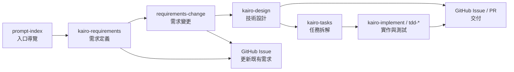

# GitHub Prompt 導覽

本目錄存放專案使用的各類 Prompt，協助 AI 助手在不同階段執行適當的任務。所有說明預設使用繁體中文，並以 GitHub Issue 作為主要交付點。

## Prompt 清單

| 檔名 | 目的 | 主要產出 | 推薦情境 |
| --- | --- | --- | --- |
| `prompt-index.prompt.md` | 入口導覽，依專案現況建議下一步指令 | 指令清單、行動建議、EARS/GWT 缺口檢視 | 不確定該用哪個指令、需要流程總覽時 |
| `kairo-requirements.prompt.md` | 以 EARS 記法整理需求與驗收標準 | `docs/spec/` Markdown、Issue 草稿 | 需求尚未完整、需要標準化需求文件 |
| `requirements-change.prompt.md` | 針對既有需求進行新增/修改，更新 EARS 與 GWT | 變更摘要、更新後的需求/GWT、Issue/PR 建議 | 已有文件但需求臨時調整或新增時 |
| `kairo-design.prompt.md` | 依已核准需求產出設計文件 | `docs/design/{要件名}/` Markdown、Issue 草稿 | 需求已確認，需要資料流、介面、API 等設計 |

> 後續可依同一規格新增其他 Prompt（例如 `kairo-tasks`、`kairo-implement` 等），並更新此表格。

## 執行流程概覽

1. 從 `prompt-index` 開始，由 AI 協助確認目前階段並列出推薦指令。
2. 需求未定義時，使用 `kairo-requirements` 建立需求文件與驗收標準。
3. 已有需求需要調整時，使用 `requirements-change` 更新 EARS 與 GWT，並規劃 Issue／PR。
4. 需求確認後，執行 `kairo-design` 產出資料流程、介面與 API 規格。
5. 若需要拆解任務，後續可導入 `kairo-tasks`（或其他自訂模板）並建立 Issue。
6. 進入實作階段時，可引導至 `kairo-implement` 或 `tdd-*` 系列，最終於 GitHub Issue/PR 留存成果。

## 使用建議

- 每份 Prompt 皆應於結尾標示下一步推薦指令，打造明確的開發導覽。
- 若新增專用模板，請同步更新本 README、Mermaid 圖與 `prompt-index` 推薦邏輯。
- 產出內容以 GitHub Issue 為優先；若需本機 Markdown，應在 Prompt 中提供檔案路徑指引。
