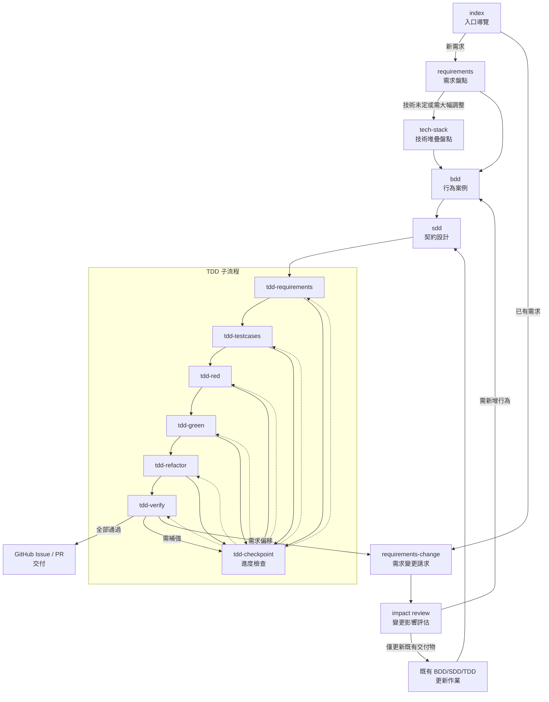

# GitHub Prompt 導覽

本目錄存放專案使用的各類 Prompt 與 Issue Template，協助 AI 與人類協作者在不同階段執行適當任務。說明預設採用繁體中文，並以 GitHub Issue 作為主要交付載體。

## Prompt 清單

| 檔名 | 目的 | 主要產出 | 推薦情境 |
| --- | --- | --- | --- |
| `tech-stack.prompt.md` | 盤點技術堆疊並補齊缺項，統一實作依據 | 技術清單（已定案 / 暫用 / 待決定）、後續待辦 | 專案初始、需要確認或更新技術決策時 |
| `index.prompt.md` | 入口導覽，依專案現況建議下一步 Prompt | 專案現況摘要、指令清單、EARS/GWT 缺口檢視 | 不確定該用哪個指令、需要流程總覽時 |
| `requirements.prompt.md` | 釐清需求來源並整理 EARS / GWT 雛形 | 需求摘要、情境清單、後續 BDD 問題集 | 需求尚未完整或需重新盤點時 |
| `requirements-change.prompt.md` | 針對既有需求變更，更新 EARS / GWT 並評估下游影響 | 變更摘要、更新後的需求與驗收描述、下游同步清單 | 已有文件但臨時調整或新增需求時 |
| `bdd.prompt.md` | 將需求轉為 Gherkin 驗收案例並建議後續 Issue | BDD Issue 內容（Scenario、驗收訊號、對應 SDD/TDD 編號） | 需求確認後，需要行為測試範例時 |
| `sdd.prompt.md` | 從 BDD 案例萃取介面 / 資料契約與合約測試 | SDD Issue 內容（契約對照表、Mock、版本策略） | 行為案例已定，需要規範契約或資料流時 |
| `tdd-checkpoint.prompt.md` | TDD 迭代中繼檢查點，僅供進度盤點與決策 | 子流程完成度盤點、阻塞／回圈判斷、後續建議 | **僅在 `tdd-requirements` 或任一 TDD 子流程完成後**，需要檢查進度或決定下一步時 |
| `commit-message.prompt.md` | 產生 Angular 風格部分提交訊息並指引 partial staging | 分支檢查、暫存建議、commit 草稿、後續動作 | TDD 各階段（Red / Green / Refactor / Verify）完成後需提交當前成果時 |

### TDD 子流程 Prompt

| 檔名 | 目的 | 主要內容 | 推薦情境 |
| --- | --- | --- | --- |
| `tdd-requirements.prompt.md` | 以 TDD 角度整理需求背景與邊界 | 功能概要、輸入輸出、限制條件、待補事項 | 初次建立 TDD Issue 或需求在迭代中有重大調整時 |
| `tdd-testcases.prompt.md` | 擴充測試矩陣，規劃 Red 階段測試 | 標準化測試矩陣、資料/Mock 要求、優先順序 | 進入 Red 前需要確認測試覆蓋與資料準備 |
| `tdd-red.prompt.md` | 撰寫會失敗的測試並記錄阻塞 | 新增測試摘要、錯誤紀錄、MCP 留言/改標籤規則 | 需要建立失敗測試或更新測試矩陣中的 Red 項目時 |
| `tdd-green.prompt.md` | 最小實作讓測試轉綠並維持紀錄 | 修改摘要、測試結果、MCP 留言/改標籤規則 | Red 測試已備妥，準備進行實作轉綠 |
| `tdd-refactor.prompt.md` | 在綠燈狀態下重構與更新文件 | 重構內容、品質檢查、技術債追蹤 | Green 完成後需整理結構、補文件或還技術債時 |
| `tdd-verify.prompt.md` | 總驗證 TDD 迭代成果 | 測試/品質檢查結果、契約同步、結束或回圈判定 | 準備提交成果或判定是否需再迭代時 |

> **TDD 基本順序**：首次進入請直接執行 `tdd-requirements`，其輸出會交給 `tdd-testcases` → `tdd-red` → `tdd-green` → `tdd-refactor` → `tdd-verify`。僅在完成 `tdd-requirements` 或任一子流程後，使用 `tdd-checkpoint.prompt.md` 檢查最新狀態與推薦下一步；**切勿在啟動 TDD 前直接呼叫檢查點 Prompt**。

> Red / Green 階段若遇到同一錯誤連續 3 次，須透過 MCP 在 TDD Issue 留言；連續 5 次則需透過 MCP 將 Issue 標籤調整為 `human_required` 並說明原因。所有 Issue 連結一律使用 `#編號` 格式（例如 `#123`）。

## Issue Template 清單

| 檔名 | 用途 | 重點欄位 |
| --- | --- | --- |
| `bdd.md` | 建立 BDD 驗收場景 Issue | Gherkin 情境、驗收訊號、對應 SDD / TDD Issue 編號 |
| `sdd.md` | 記錄契約設計與合約測試計畫 | 契約對照表、Mock/樣本策略、版本與部署規劃 |
| `tdd.md` | 追蹤 TDD 測試與實作進度 | 測試矩陣、流程紀錄、風險應對、後續交付 |
| `bug_report.md` | 標準化缺陷回報，含嚴重度與相關 Scenario | 復現步驟、預期/實際行為、環境與風險、後續建議 |

## 執行流程概覽



1. 先執行 `index` 盤點現況與缺口。若發現技術尚未定義或變更幅度大，再啟動 `tech-stack`。  
2. `requirements` 用於建立新需求；`requirements-change` 啟動後需先在「變更影響評估」整理既有 BDD / SDD / TDD Issue 是否更新即可，僅在需要新增行為時才重新進入 BDD。  
3. BDD → SDD → TDD 逐步深化：先定義行為情境，再契約化介面/資料，最後規劃測試與實作。既有 Scenario 或契約若僅需調整，沿用對應 Issue 更新即可。  
4. 進入 TDD 時，先執行 `tdd-requirements` 建立背景，再依 `tdd-testcases` → `tdd-red` → `tdd-green` → `tdd-refactor` → `tdd-verify` 的順序推進；`tdd-checkpoint.prompt.md` 單純在各階段之間做進度檢查與回圈判斷，`tdd-verify` 未通過時依檢查結果回到適當階段或 `requirements-change`。  
5. 驗證通過後，接續任務拆解或實作流程（建立 PR、同步程式碼）並更新 GitHub Issue / PR。

### TDD 入口決策

| 情境 | 採取的 Prompt | 備註 |
| --- | --- | --- |
| 尚未建立 TDD Issue 或第一次進行該需求的測試迭代 | `tdd-requirements.prompt.md` | 建立背景、輸入輸出與限制；產出直接交給 `tdd-testcases` |
| 已完成 `tdd-requirements`，準備設計測試案例 | `tdd-testcases.prompt.md` | 若遇到契約資料缺口，請依表格中的判斷回到 `sdd` 或補資料 |
| 任一 TDD 子流程完成後需要確認下一步或統整阻塞 | `tdd-checkpoint.prompt.md` | 單純盤點進度與缺口，輸出推薦的下一個子 Prompt 或待解阻塞 |
| TDD 子流程執行中斷、遇到需求矛盾或跨子系統影響 | `tdd-checkpoint.prompt.md`（彙整議題）→ 視情況轉 `requirements-change.prompt.md` | `tdd-checkpoint` 僅列阻塞與疑慮；是否回圈由 `tdd-verify` 結案判定 |
| TDD 各階段完成（Red / Green / Refactor / Verify）需提交成果 | `commit-message.prompt.md` | 確認分支為 `tdd-*`、僅暫存該階段檔案並產生 Angular 風格 commit |

### 流程 Pseudocode

以下用 Python 語法示意主要流程：當 `index.prompt.md` 判定技術決策還不穩定時，會先引導執行 `tech-stack.prompt.md`，補齊共用的技術堆疊基準，再往下走需求、BDD、SDD 與 TDD。

```python
class PromptState:
    context: object # 供下一個 Prompt 使用的輸入資料，通常是上一個 Prompt 的輸出
    recommendations: Set[str] # 建議後續應執行的 Prompt 名稱，例如 {"requirements", "tech-stack"}

class ChangeState(PromptState):
    """`requirements-change.prompt.md` 的回傳格式。"""
    only_updates_existing: bool  # True 表示僅需更新既有 Issue，不需新增流程
    next_inputs: Optional[dict]  # 若需新增行為，交給後續 Prompt 的輸入資料
    targets: list[str]           # 需要同步的既有 Issue 編號（字串，如 "#123"）

class NextPrompt:
    file: str        # 下一個要執行的 Prompt 檔名
    context: dict    # 下一個 Prompt 所需輸入
    requires_requirement_change: bool = False  # True 表示需回到 requirements-change

class TDDState(PromptState):
    """TDD 流程的回傳格式。"""
    is_verified: bool                 # 全部子流程是否已驗證完成（true 即可交付）
    next_prompt: Optional[NextPrompt] # TDD 流程尚未完成時，下一個建議的 TDD 子 Prompt
    summary: dict                     # 交付摘要（接著會送往 deliver_to_github）

    def refresh_context(self) -> list[object]:
        """回傳迭代歷程（例如各階段輸出列表），供下一次呼叫 `tdd-checkpoint.prompt.md` 使用。"""
        context = self.context or []
        if isinstance(context, list):
            return list(context)
        return [context]


def delivery_pipeline(context: dict) -> dict:
    """串起各 Prompt 的最小流程，並標註欄位含意。"""

    # 1. 入口盤點 ─ 若缺少技術棧，建議先跑 tech-stack
    index_state: PromptState = run("index.prompt.md", context)
    if "tech-stack" in index_state.recommendations:
        run("tech-stack.prompt.md", index_state.context)

    # 2. 建立或調整需求
    if "requirements" in index_state.recommendations:
        req_state: PromptState = run("requirements.prompt.md", index_state.context)
    else:
        change_state: ChangeState = run("requirements-change.prompt.md", index_state.context)
        if change_state.only_updates_existing:
            update_existing_issues(change_state.targets)
            req_state = None
        else:
            req_state = change_state.next_inputs

    # 3. 行為（BDD）與契約（SDD）
    if req_state:
        bdd_state: PromptState = run("bdd.prompt.md", req_state)
    else:
        bdd_state = index_state.context.get("existing_bdd")

    needs_contract_update = bool(bdd_state and bdd_state.context.get("needs_contract_update"))
    if needs_contract_update:
        sdd_state: PromptState = run("sdd.prompt.md", bdd_state)
    else:
        sdd_state = index_state.context.get("existing_sdd")

    # 4. TDD 迭代（必要時回到需求變更）
    tdd_requirements: PromptState = run("tdd-requirements.prompt.md", sdd_state)
    history = [tdd_requirements.context]
    tdd_state: TDDState = run("tdd-checkpoint.prompt.md", {
        "stage": "tdd-requirements",
        "latest": tdd_requirements.context,
        "history": list(history),
    })
    while not tdd_state.is_verified:
        assert tdd_state.next_prompt is not None
        stage_result = run(tdd_state.next_prompt.file, tdd_state.next_prompt.context)
        if tdd_state.next_prompt.requires_requirement_change:
            return delivery_pipeline(stage_result)
        history = tdd_state.refresh_context()
        history.append(stage_result)
        tdd_state = run("tdd-checkpoint.prompt.md", {
            "stage": tdd_state.next_prompt.file,
            "latest": stage_result,
            "history": history,
        })

    # 5. 交付成果
    return deliver_to_github(tdd_state.summary)


# 以下函式為範例佔位，實際專案可由 CLI / MCP 實作

def run(prompt_file: str, context: dict):
    ...


def update_existing_issues(targets):
    ...


def deliver_to_github(summary: dict) -> dict:
    ...
```


## 信賴等級與來源標註規範

- 已能引用的資料（Issue、PR、文件）直接附上 `#編號` 或相對路徑即可，視為高信賴，無須額外標示符號。
- 僅在資訊屬於推測或待確認時補上符號：🟡（推測，待驗證）、🔴（尚無佐證）。
- 若資訊僅來自同步對話或未記錄的口頭說明，請標註 `（來源 使用者說明 🔴）` 並列入待辦補強。

## Issue 引用與連結規範

- 內部 Issue／PR：使用 `#編號`（例如 `#128`）。
- 跨 repo：使用 `owner/repo#編號`（例如 `tsumiki/prompt-repo#17`）。
- 指向特定留言時，於文字描述附上「留言者／時間」，避免依賴長網址。
- 回覆完成後，請提醒使用者或透過 MCP 將輸出內容回寫到對應 Issue，保持單一事實來源。

> 若需詳細操作步驟，請參考 `.github/prompts/_issue-ops-guide.md`，其中整理了 MCP 與手動流程以及各模板建議欄位。

## MCP 錯誤處理與回圈規則

- **連續錯誤累計**：同一測試（測試檔 + 測試名稱 + 錯誤訊息前 120 字）連續 3 次失敗 → 透過 MCP 在 TDD Issue 留言記錄錯誤、已嘗試步驟與下一步；連續 5 次 → MCP 將 Issue 標籤改為 `human_required` 並說明原因與建議回圈（如返回 `requirements-change`）。
- **分類標準**：統一使用 `Test Failure`、`Build/Setup Failure`、`External Dependency`、`Spec Mismatch` 方便彙整與追蹤。
- 各 TDD 子 Prompt 僅需引用本段規則，避免重複描述造成分歧。

> **責任分工**：Red/Green/Refactor 只需記錄錯誤與疑慮（標註 🟡／🔴），最終是否回圈由 `tdd-checkpoint.prompt.md`（進度調度）與 `tdd-verify.prompt.md`（結案判定）統一決策。

## TDD 提交節奏
- **Red**：每個失敗測試至少一個 commit，內容僅含測試檔及必要輔助檔案。
- **Green**：對應測試轉綠後立即提交，確保最小實作可追溯。
- **Refactor**：以重構主題分批提交（命名、抽象、效能調整等），維持測試綠燈。
- **Verify**：總驗證與文件同步後提交一次，若需 squash 由後續合併流程處理。
- 任何提交都應在 `tdd-*` 分支上完成，partial staging 請依 `commit-message.prompt.md` 建議操作。

## 需求變更觸發檢查表（供 `requirements-change.prompt.md` 及下游參考）

| 觸發情境 | 判定流程 | 建議動作 |
| --- | --- | --- |
| 新增或大幅調整使用情境、使用者故事、EARS 條目 | 確認是否已有對應 Scenario／契約 | 執行 `requirements-change.prompt.md` 更新需求基線；若已有 BDD Scenario，標記需調整項目並同步 `bdd` |
| 合約欄位／資料格式缺失，或跨系統介面改動 | 若契約已存在 → 回 SDD；若需求敘述模糊 → 先回需求 | 先透過 `requirements-change` 釐清需求，再執行 `sdd` 更新契約與版本策略 |
| 測試案例與 Scenario 不符、測試資料無法對應 | 比對測試矩陣與 Scenario/契約；屬需求差異即回需求 | 若是資料樣本不足 → `tdd-testcases`／`tdd-red` 補 mock；若 Scenario 失真 → `requirements-change` 修正需求並更新 BDD |
| 監控指標、SLO、部署或 CI/CD 守門條件改變 | 檢查是否影響交付品質或驗收標準 | 視為需求調整，更新 `requirements-change`，並同步提醒 `tdd-verify`、CI/CD 維護者 |


## 自動化腳本

| 腳本 | 說明 |
| --- | --- |
| `scripts/tdd-cycle.sh` | 依序觸發 `tdd-requirements → tdd-testcases → tdd-red → tdd-green → tdd-refactor → tdd-verify`，支援指定 Issue 編號、測試名稱與略過前置階段。請在執行過程遵守 MCP 留言與標籤調整規則；腳本內含錯誤捕捉，失敗時請回到 TDD Issue 更新阻塞。 |

### 異常情境處理

- `requirements` ↔ `requirements-change`：若 `docs/spec/` 或既有 Issue/PR 中已有正式需求，即視為「既有需求」。執行 `requirements-change` 時請先用變更影響評估檢查既有 BDD / SDD / TDD Issue 是否只需更新；僅在新增行為或契約時再走完整流程。
- BDD / SDD 迭代：在 SDD 或 TDD 發現情境缺漏時，優先更新既有 BDD Issue 的 Scenario，並同步註記受影響的 SDD / TDD Issue（使用 `#編號` 格式）。
- TDD 回圈：`tdd-verify` 未通過時，依檢查清單判定要回到 `tdd-red`（測試不足）、`tdd-green`（實作未完成）或 `tdd-refactor`（品質問題）；若產生需求差異則轉回 `requirements-change`。
- 回圈決策：Red / Green / Refactor 僅標記疑慮；實際是否回到上游階段以 `tdd-checkpoint` 或 `tdd-verify` 的結論為準。
- 技術堆疊：發生重大技術調整、部署目標或跨專案共用時，再啟動 `tech-stack` 重新盤點並更新 README 與相關 Issue。

### Issue 關聯規範

- 所有 BDD / SDD / TDD Issue 需在描述欄內標示來源需求（Issue 編號或文件路徑）與信賴等級符號（🔵／🟡／🔴）。
- BDD Issue 的「關聯工作」欄必須填寫對應 SDD / TDD Issue 編號，格式建議 `#123 (SDD)`、`#124 (TDD)`；若尚未建立，請標記 `待建立` 並在輸出提供建議標題。
- SDD Issue 應列出所依賴的 BDD Scenario 標籤（例如 `BDD-001`）與預計更新的契約檔案路徑。
- TDD Issue 中的測試矩陣需同步列出對應 BDD Scenario 與 SDD 契約 ID，方便追蹤來源。
- 建議透過 MCP 操作 GitHub 時，一併更新彼此的 Issue 交互連結與狀態（例如使用 `linked pull requests`、`/link` 指令）。

#### Scenario ↔ Issue 對照範例

```markdown
| Scenario ID | 說明 | 需求 # | SDD Issue | TDD Issue | 狀態 |
| --- | --- | --- | --- | --- | --- |
| BDD-001 | 使用者登入成功 | #101 | #202 | #303 | ✅ |
| BDD-002 | OTP 驗證失敗 | #101 | #202 | #304 | ⚠️ Mock 待補 🟡 |
| BDD-003 | 帳號鎖定提示 | #101 | 待建立 | 待建立 | 🔴 需求待確認 |
```

> BDD 完成後請在 SDD / TDD Issue 內更新此表，並於每次迭代同步狀態。

### TDD 自動化腳本注意事項

- `scripts/tdd-cycle.sh` 執行失敗時，請查看 CLI 回傳碼：非零代表某個 Prompt 未完成，需手動檢查輸出並至少更新 TDD Issue 的阻塞欄位。
- 若 MCP 操作（留言、改標籤）失敗，腳本不會自動重試；請人工處理並在 Issue 中註明。
- 使用 `--skip-*` 參數時，請確保已手動完成對應階段並在 TDD Issue 中標記為 ✅，避免跳過必要步驟。
- 每輪執行結束後，確認 CLI 輸出含有「✅ TDD 全流程執行完畢」字樣；若無，視為未完成需重新檢查。

## 使用建議

- 每個 Prompt 末段皆會建議下一步操作，形成清楚的導覽。
- 新增 Prompt 或 Issue Template 時，請同步更新本 README、Mermaid 圖與 `index.prompt.md` 的推薦邏輯。
- 儘量使用 GitHub Issue 留存成果；若需輸出本地 Markdown，請在 Prompt 中明確指示檔案路徑。
- 使用 MCP 操作 GitHub（留言、變更標籤、建立 Issue 等）時，務必附上理由與對應的錯誤紀錄，維持追蹤性。
- 實作或撰寫腳本時，請回顧 `tech-stack.prompt.md`、`README.md`、`AGENTS.md` 技術堆疊章節，確保決策一致並即時更新。

## 各種 CLI 存放 Prompt 位置

- GitHub Copilot：`$HOME/Library/Application Support/Code/User/prompts`
- Codex CLI：`~/.codex/prompts`

```shell
cp -r ~/.codex/prompts/* "$HOME/Library/Application Support/Code/User/prompts/"
```
