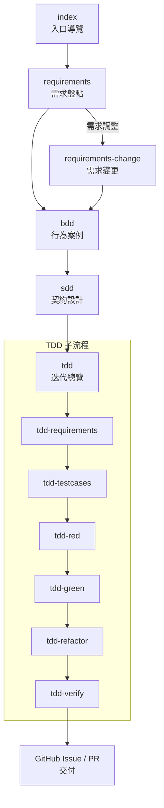

# GitHub Prompt 導覽

本目錄存放專案使用的各類 Prompt 與 Issue Template，協助 AI 與人類協作者在不同階段執行適當任務。說明預設採用繁體中文，並以 GitHub Issue 作為主要交付載體。

## Prompt 清單

| 檔名 | 目的 | 主要產出 | 推薦情境 |
| --- | --- | --- | --- |
| `index.prompt.md` | 入口導覽，依專案現況建議下一步 Prompt | 專案現況摘要、指令清單、EARS/GWT 缺口檢視 | 不確定該用哪個指令、需要流程總覽時 |
| `requirements.prompt.md` | 釐清需求來源並整理 EARS / GWT 雛形 | 需求摘要、情境清單、後續 BDD 問題集 | 需求尚未完整或需重新盤點時 |
| `requirements-change.prompt.md` | 針對既有需求變更，更新 EARS / GWT | 變更摘要、更新後的需求與驗收描述 | 已有文件但臨時調整或新增需求時 |
| `bdd.prompt.md` | 將需求轉為 Gherkin 驗收案例並建議後續 Issue | BDD Issue 內容（Scenario、驗收訊號、對應 SDD/TDD 編號） | 需求確認後，需要行為測試範例時 |
| `sdd.prompt.md` | 從 BDD 案例萃取介面 / 資料契約與合約測試 | SDD Issue 內容（契約對照表、Mock、版本策略） | 行為案例已定，需要規範契約或資料流時 |
| `tdd.prompt.md` | TDD 迭代總覽，決定下一個子 Prompt | 現況評估、子流程建議、阻塞清單 | 需要掌握 TDD 進度或排程下一步時 |

### TDD 子流程 Prompt

| 檔名 | 目的 | 主要內容 |
| --- | --- | --- |
| `tdd-requirements.prompt.md` | 以 TDD 角度整理需求背景與邊界 | 功能概要、輸入輸出、限制條件、待補事項 |
| `tdd-testcases.prompt.md` | 擴充測試矩陣，規劃 Red 階段測試 | 測試項目清單、資料/Mock 要求、優先順序 |
| `tdd-red.prompt.md` | 撰寫會失敗的測試並記錄阻塞 | 新增測試摘要、錯誤紀錄、MCP 留言/改標籤規則 |
| `tdd-green.prompt.md` | 最小實作讓測試轉綠並維持紀錄 | 修改摘要、測試結果、MCP 留言/改標籤規則 |
| `tdd-refactor.prompt.md` | 在綠燈狀態下重構與更新文件 | 重構內容、品質檢查、技術債追蹤 |
| `tdd-verify.prompt.md` | 總驗證 TDD 迭代成果 | 測試/品質檢查結果、契約同步、結束或回圈判定 |

> Red / Green 階段若遇到同一錯誤連續 3 次，須透過 MCP 在 TDD Issue 留言；連續 5 次則需透過 MCP 將 Issue 標籤調整為 `human_required` 並說明原因。

## Issue Template 清單

| 檔名 | 用途 | 重點欄位 |
| --- | --- | --- |
| `bdd.md` | 建立 BDD 驗收場景 Issue | Gherkin 情境、驗收訊號、對應 SDD / TDD Issue 編號 |
| `sdd.md` | 記錄契約設計與合約測試計畫 | 契約對照表、Mock/樣本策略、版本與部署規劃 |
| `tdd.md` | 追蹤 TDD 測試與實作進度 | 測試矩陣、流程紀錄、風險應對、後續交付 |
| `bug_report.md` | 既有的錯誤回報模板 | 再現步驟、預期行為、實際行為、環境資訊 |

## 執行流程概覽

1. 從 `index` 確認專案現況與缺口，再決定下一步。  
2. `requirements` 整理需求雛形，若需求變更則使用 `requirements-change`。  
3. BDD → SDD → TDD 逐步深化：先定義行為情境，再契約化介面/資料，最後規劃測試與實作。  
4. TDD 透過總覽 Prompt 與六個子流程反覆迭代，必要時可由 `tdd-red`/`tdd-green` 透過 MCP 留言或調整 Issue 標籤。  
5. 完成驗證後，可進入 `design` 或其他任務拆解 / 實作流程，並將成果同步至 GitHub Issue / PR。

## 自動化腳本

| 腳本 | 說明 |
| --- | --- |
| `scripts/tdd-cycle.sh` | 依序觸發 `tdd-requirements → tdd-testcases → tdd-red → tdd-green → tdd-refactor → tdd-verify`，支援指定 Issue 編號、測試名稱與略過前置階段。請在執行過程遵守 MCP 留言與標籤調整規則。 |

## 使用建議

- 每個 Prompt 末段皆會建議下一步操作，形成清楚的導覽。
- 新增 Prompt 或 Issue Template 時，請同步更新本 README、Mermaid 圖與 `index.prompt.md` 的推薦邏輯。
- 儘量使用 GitHub Issue 留存成果；若需輸出本地 Markdown，請在 Prompt 中明確指示檔案路徑。
- 使用 MCP 操作 GitHub（留言、變更標籤、建立 Issue 等）時，務必附上理由與對應的錯誤紀錄，維持追蹤性。
