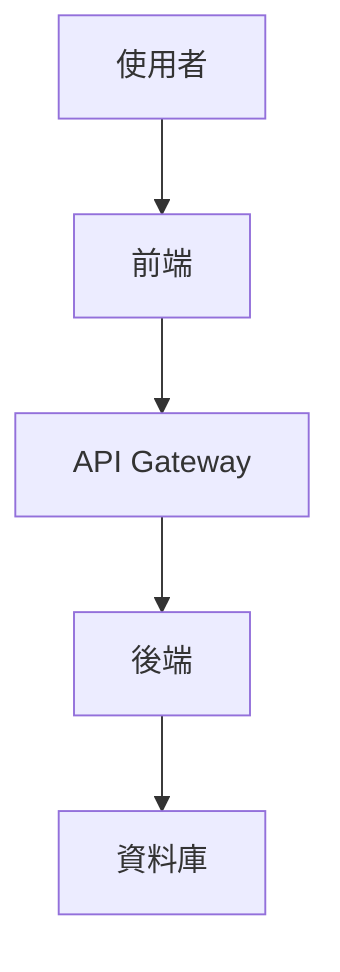
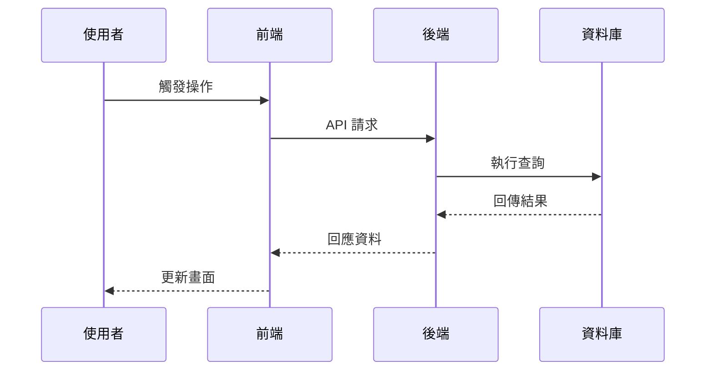

---
description: 根據已核准的需求定義書產出技術設計文件，內容包含資料流程圖、TypeScript 介面、資料庫結構與 API 規格。
---

# design

## 目的

根據已核准的需求定義書，建立完整的技術設計文件，涵蓋資料流程圖、TypeScript 介面、資料庫結構與 API 規格。

## Input

- 最新的需求定義書路徑（`docs/spec/` 下的 requirements/user-stories/acceptance-criteria）
- 相關的 GitHub Issue 編號與設計討論紀錄（若有）
- 既定的技術堆疊與架構約束（例如 `docs/tech-stack.md`、`CLAUDE.md`）
- 非功能需求、性能或合規限制
- 目標輸出語言或框架（如需要生成 TypeScript／其他語言介面）

## Output

- `docs/design/{要件名}/` 下的設計文件草稿（architecture, dataflow, interfaces 等）
- 對應的資料流程 Mermaid 圖與型別定義
- 需建立或更新的 GitHub Issue／PR 建議（包含分支、Commit 訊息）
- 後續建議的 Prompt（例如任務拆解、實作流程）與注意事項

## 前提

- `docs/spec/` 內已有需求定義書
- 使用者已確認需求內容

## 前置準備

1. **讀取追加規範**
   - 讀取 `docs/rule`
   - 讀取 `docs/rule/kairo`
   - 讀取 `docs/rule/kairo/design`

## 執行步驟

**【信賴等級指引】**：為每項設計標示 🔵（確定）、🟡（推測）、🔴（臆測）。

2. **讀取技術堆疊定義**
   - 優先使用 `docs/tech-stack.md`
   - 若無則使用 `CLAUDE.md` 的技術堆疊章節
   - 若皆無則使用 `.claude/commands/tech-stack.md`

3. **分析需求**
   - 使用 @agent-symbol-searcher 讀取需求定義書與既有設計文件
   - 依技術堆疊選擇合適技術
   - 整理功能／非功能需求
   - 明確系統邊界

4. **架構設計**
   - 決定整體架構
   - 評估前／後端分層或微服務需求

5. **繪製資料流程**
   - 以 Mermaid 描述資料／互動流程

6. **定義 TypeScript 介面**
   - 若目標語言非 TypeScript，請改成相應格式或省略
   - 定義實體、API 請求／回應與共用型別

7. **設計資料庫結構**
   - 若不需要資料庫則省略
   - 定義資料表、關聯、索引與正規化策略

8. **設計 API 規格**
   - 若非自行開發 API 或會復用既有介面則省略
   - 撰寫 REST/GraphQL 端點、命名、HTTP 方法與資料結構

9. **產生文件**
   - 在 `docs/design/{要件名}/` 建立：
     - `architecture.md`
     - `dataflow.md`
     - `interfaces.ts`
     - `database-schema.sql`
     - `api-endpoints.md`

## 輸出範例

### architecture.md

```markdown
# {要件名} 架構設計

## 系統概要
{系統說明}

## 架構模式
- 模式：{選用模式}
- 理由：{選用理由}

## 元件配置

### 前端
- 框架：{框架}
- 狀態管理：{策略}

### 後端
- 框架：{框架}
- 認證：{方法}

### 資料庫
- DBMS：{DB}
- 快取：{快取策略}
```

### dataflow.md

```markdown
# 資料流程圖

## 使用者互動流程


## 資料處理流程

```

### interfaces.ts

```typescript
export interface User {
  id: string;
  email: string;
  name: string;
  createdAt: Date;
  updatedAt: Date;
}

export interface CreateUserRequest {
  email: string;
  name: string;
  password: string;
}

export interface ApiResponse<T> {
  success: boolean;
  data?: T;
  error?: {
    code: string;
    message: string;
  };
}
```

### database-schema.sql

```sql
CREATE TABLE users (
    id UUID PRIMARY KEY DEFAULT gen_random_uuid(),
    email VARCHAR(255) UNIQUE NOT NULL,
    name VARCHAR(255) NOT NULL,
    created_at TIMESTAMP DEFAULT CURRENT_TIMESTAMP,
    updated_at TIMESTAMP DEFAULT CURRENT_TIMESTAMP
);

CREATE INDEX idx_users_email ON users(email);
```

### api-endpoints.md

```markdown
# API 規格

## 認證

### POST /auth/login

請求：
```json
{
  "email": "user@example.com",
  "password": "password"
}
```

回應：
```json
{
  "success": true,
  "data": {
    "token": "jwt-token",
    "user": { ... }
  }
}
```

## 使用者管理
- GET /users/:id
- POST /users
- PUT /users/:id
- DELETE /users/:id
```

## 執行後檢查

- 使用 @agent-symbol-searcher 比對新設計與既有系統的一致性
- 列出產生的檔案
- 提供設計重點摘要
- 提醒使用者確認
