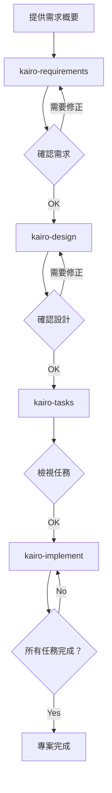

# Tsumiki 手冊

## 使用方式

### 設定

在開始使用專案前，請先將 `commands` 目錄內容複製到 Claude 的指令目錄：

```bash
# 將專案的 commands 目錄複製到 ~/.claude/commands
cp -r commands ~/.claude/commands/

# 或於專案目錄中執行
mkdir -p .claude
cp -r commands .claude/
```

#### 選用：設定專案專屬規則

完成基本設定後，可加入專案專屬規則或設定。將檔案放在 `docs/rule/{類別1}/{類別2}` 結構下，對應的指令在執行時就會自動載入。

**自動讀取的目錄層級**：
- `docs/rule/`（共用規則）
- `docs/rule/{類別1}/`（類別層級規則）
- `docs/rule/{類別1}/{類別2}/`（更細緻的規則）

**範例**：執行 `kairo-requirements` 時會依序讀取
```
docs/rule/                    # 全指令共用規則
docs/rule/kairo/              # kairo 指令共用規則
docs/rule/kairo/requirements/ # kairo-requirements 專用規則
```

上述目錄中的 `.md` 檔案都會在指令執行時自動載入成為上下文。

### TDD 指令

若在建立 TASK 時判定為 `TDD`，並希望個別執行 TDD 流程，可依序執行以下指令：

```
# TDD 需求定義
/tdd-requirements 任務檔名 TASK 編號

# 測試案例建立
/tdd-testcases 任務檔名 TASK 編號

# 若要自動化完成 Red→Green→Refactor→Verify
/tdd-cycle-full.sh "任務檔名 TASK 編號"

# 測試實作（Red）
/tdd-red 任務檔名 TASK 編號

# 最小實作（Green）
/tdd-green 任務檔名 TASK 編號

# 重構
/tdd-refactor 任務檔名 TASK 編號

# TDD 完成確認
/tdd-verify-complete 任務檔名 TASK 編號
```

### DIRECT 指令

若 TASK 被判定為 `DIRECT`，請依序執行：

```
# DIRECT 準備
/direct-setup 任務檔名 TASK 編號

# DIRECT 驗證
/direct-verify 任務檔名 TASK 編號
```

### Kairo 指令（完整流程）

#### 1. 技術堆疊初始化

初始化專案技術堆疊（框架、函式庫）：

```
/init-tech-stack
```

`init-tech-stack` 會產生：

- 位置：`/docs/tech-stack.md`

#### 2. 需求定義

先向 Kairo 說明專案需求概要：

```
/kairo-requirements 需求概要

# 範例：
# "想實作電商網站的商品評論功能。
#  使用者可以對商品給予五顆星評分與留言，
#  並瀏覽其他人的評論。"
```

Kairo 會產出：
- 使用者故事
- EARS 記法的詳細需求定義
- 邊界情境考量
- 驗收標準

輸出檔案位置：`/docs/spec/{要件名}-requirements.md`

#### 3. 設計

確認需求後即可請求設計（可先告知需求已確認）：

```
/kairo-design（可省略）
```

Kairo 會產出：
- 架構設計說明
- 資料流程圖（Mermaid）
- TypeScript 介面定義
- 資料庫結構
- API 端點規格

輸出檔案位置：`/docs/design/{要件名}/`

#### 4. 任務拆解

檢視設計（可選）後執行任務拆解：

```
/kairo-tasks
```

建議接著執行 `/kairo-task-verify` 以再次確認任務內容。

Kairo 會產出：
- 考量依存關係的任務列表
- 每個任務的細節（含測試與 UI/UX 要求）
- 執行順序與時程

輸出檔案位置：`/docs/tasks/{要件名}-tasks.md`

#### 5. 實作

確認任務後即可開始實作（建議親自執行 TDD 或 DIRECT 流程）：

```
# 依序實作所有任務
/kairo-implement

# 只實作特定任務
/kairo-implement 任務檔名 TASK 編號
# 例如：「請實作 TASK-101」
```

Kairo 在內部會依序呼叫以下 TDD 指令：
1. `tdd-requirements`
2. `tdd-testcases`
3. `tdd-red`
4. `tdd-green`
5. `tdd-refactor`
6. `tdd-verify-complete`

### 逆向工程指令

若要從既有程式碼逆向產出文件，可依序執行：

```
# 分析既有程式的任務結構
/rev-tasks

# 逆生成設計文件（建議在任務分析後執行）
/rev-design

# 逆生成測試規格（建議在取得設計文件後執行）
/rev-specs

# 逆生成需求定義書（建議所有分析完成後執行）
/rev-requirements
```

#### 逆向工程詳細說明

##### 概觀

逆向工程指令會分析既有程式，從實作推回各類文件。

##### 建議順序

1. **rev-tasks**：掌握整體任務結構
2. **rev-design**：生成架構與設計文件
3. **rev-specs**：生成測試規格
4. **rev-requirements**：最後生成需求定義

##### 指令說明

###### rev-tasks（任務結構分析）

**目的**：從既有程式抽取與整理實作功能

**輸出檔案**：
- `docs/reverse/{專案名}-discovered-tasks.md`

**分析範圍**：
- 程式結構
- 已實作功能
- API 端點
- 資料庫結構
- 任務依存關係推測

###### rev-design（逆生成設計文件）

**目的**：依現有架構產出技術設計文件

**輸出檔案**：
- `docs/reverse/{專案名}-architecture.md`
- `docs/reverse/{專案名}-dataflow.md`
- `docs/reverse/{專案名}-api-specs.md`
- `docs/reverse/{專案名}-database.md`
- `docs/reverse/{專案名}-interfaces.ts`

**分析範圍**：
- 架構模式
- 資料流程
- API 規格
- 資料庫結構
- TypeScript 型別

###### rev-specs（逆生成測試規格）

**目的**：從實作產出測試案例與規格

**輸出檔案**：
- `docs/reverse/{專案名}-test-specs.md`
- `docs/reverse/{專案名}-test-cases.md`
- `docs/reverse/tests/`（產生的測試程式）

**分析範圍**：
- 既有測試狀態
- 不足的測試案例
- API 測試案例
- UI 元件測試
- 效能／安全測試建議

###### rev-requirements（逆生成需求定義）

**目的**：以 EARS 記法從實作推導需求

**輸出檔案**：
- `docs/reverse/{專案名}-requirements.md`

**分析範圍**：
- 使用者故事
- EARS 需求分類
- 非功能需求推測
- 邊界情境
- 驗收標準

##### 使用範例

```bash
/rev-tasks       # 掌握任務結構
/rev-design      # 文檔化架構與設計
/rev-specs       # 分析測試並找出缺口
/rev-requirements# 逆生成需求定義書
```

##### 注意事項

- 每個階段輸出的內容都需要人工審閱
- 推測出的需求可能與實際商業需求不同
- 測試案例是依現況推導，可能不完整

## 目錄結構

```
/projects/ai/test18/
├── .claude/
│   └── commands/           # Kairo 指令
├── docs/
│   ├── implements/        # 實作相關文件
│   │   └── {TASKID}/
│   ├── spec/              # 需求定義書
│   ├── design/            # 設計文件
│   ├── tasks/             # 任務列表
│   └── reverse/           # 逆向生成文件
├── backend/              # 後端程式碼
├── frontend/             # 前端程式碼
└── database/             # 資料庫相關
```

## 工作流程範例



## 優點

1. **流程一致**
   - 從需求到實作皆為統一流程
   - 以 EARS 記法撰寫清晰需求

2. **品質保證**
   - 透過 TDD 指令建構穩固實作
   - 提供全面的測試覆蓋率

3. **開發效率**
   - 自動任務拆解與優先順序
   - 依存關係一目瞭然

4. **文件齊全**
   - 需求、設計、實作全程文件化
   - 後續查閱方便

## 注意事項

- 各階段會要求使用者確認
- 請務必審閱產生的內容
- 可依專案特性調整流程

## 疑難排解

### Q：需求太複雜怎麼辦？
A：請將需求拆成多個小功能，分別交給 Kairo 處理。

### Q：能套用在既有程式嗎？
A：可以。可先分析現有程式，再用於新增或修改功能。

### Q：可以自訂嗎？
A：可直接編輯各指令檔案，調整成符合專案需求的內容。

## 支援

若有問題或建議，請在專案的 Issue Tracker 回報。
