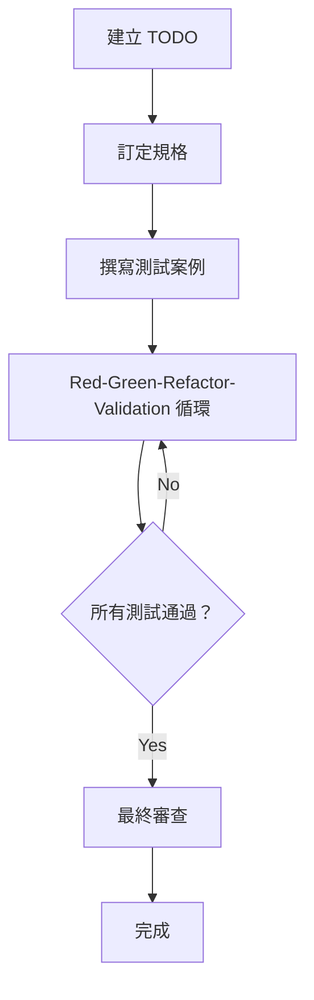

# 3.1 擴充版 TDD 流程總覽

## AITDD 流程概觀

AITDD 在傳統 TDD（Test-Driven Development）基礎上加入 AI 助力，並新增 **Validation** 步驟。透過人機協作，可以更快速且穩定地交付高品質軟體。

## 流程結構



### 基本流程
```
建立 TODO → 訂定規格 → 撰寫測試案例 → Red-Green-Refactor-Validation → 最終審查
```

## 各步驟詳解

### 1. 建立 TODO（人類負責）
**目的**：將開發工作拆解成清楚、可執行的任務。  
**內容**：萃取需求、拆分任務、設定優先順序、釐清範圍。  
**產出**：`todo.md`（含具體任務、依賴、完成條件）。

### 2. 訂定規格（人類負責，需審查）
**目的**：把 TODO 轉為可實作的詳細技術規格。  
**內容**：定義功能、輸入輸出、錯誤處理、效能需求。  
**重點**：AI 可提供建議，但最終由人確認。  
**產出**：`requirements.md`（功能、限制、品質要求）。

### 3. 撰寫測試案例（人類負責，需審查）
**目的**：依規格設計完整的測試計畫。  
**內容**：涵蓋正常／異常／邊界情境與特殊案例。  
**重點**：確保測試全面且與規格一致。  
**產出**：`testcases.md`（測試清單、預期行為、資料）。

### 4. Red-Green-Refactor-Validation 循環（AI 主導，人類監督）
此循環在傳統 TDD 上新增 **Validation** 步驟，多數操作交由 AI 執行，並在必要時由人介入。

- **Red**：撰寫測試並確認失敗
- **Green**：以最小實作讓測試通過
- **Refactor**：改善程式品質與結構
- **Validation**：檢查實作是否合理且符合同步需求

### 5. 最終審查（人類負責）
**目的**：對最終成果做全面品質檢查。  
**內容**：審閱程式碼、驗證規格、檢查資安與效能。  
**重點**：務必由人進行，確保可正式上線。

## 人機分工

### AI（如 Claude）擅長的部分
- 執行 Red-Green-Refactor-Validation 循環
- 生成、重構、最佳化程式碼
- 自動執行測試與分析結果

### 人類的責任
- 高階決策：設計、規格、測試計畫
- 品質保證：審查程式、檢查資安與業務需求
- 創造性工作：問題解決、使用者體驗、技術選型

## 與傳統 TDD 的比較

| 項目 | 傳統 TDD | AITDD |
|------|-----------|--------|
| 流程 | Red-Green-Refactor | Red-Green-Refactor-**Validation** |
| 實作者 | 人類 | **AI 為主（人類監督）** |
| 審查時機 | 實作後 | **規格、測試、程式都有審查** |
| 速度 | 受限於人工 | **AI 協助後大幅提速** |
| 品質 | 依賴個人能力 | **建立多層防線** |
| 學習成本 | 熟悉 TDD | **需熟悉 TDD 與 AI 協作** |

## 流程優勢

1. **速度提升**：AI 自動處理大量實作與測試。  
2. **品質穩定**：透過 Validation 增加檢查層次；人機雙重把關。  
3. **知識應用**：AI 隨時引用最新最佳實務，新手也能寫出高品質程式。  
4. **持續改善**：透過回饋，持續優化提示與流程；團隊整體實力提升。

## 風險與注意事項

1. **避免完全依賴 AI**：重要決策與審查仍需人把關。  
2. **強化品質管理**：多次審查、結合自動與手動測試。  
3. **保留彈性**：依專案與團隊狀況調整流程，持續優化。

## 下一步

第 3 章接下來將深入介紹各步驟的實作細節：
- [3.2 建立 TODO 與訂定規格](./02-todo-and-specification.md)
- [3.3 撰寫測試案例](./03-test-case-creation.md)
- [3.4 Red-Green-Refactor-Validation 詳解](./04-rgr-validation-cycle.md)
- [3.5 Validation 步驟深入探討](./05-validation-details.md)

讓我們進一步掌握實作技巧，真正運用 AITDD 完成開發工作。
