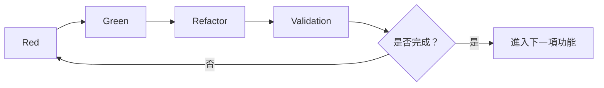

# 3.4 Red-Green-Refactor-Validation 循環

## 擴充版 TDD 概要

AITDD 的核心是將傳統 TDD（Red-Green-Refactor）擴充，新增 **Validation** 步驟。此循環主要由 AI 執行，但仍在人的監督下完成，以確保高品質且高效率的交付。



## 四個階段的詳細說明

### Red：確認測試失敗

**目標**：先撰寫測試並確認目前程式尚未通過，確保測試本身正確。

**步驟：**
1. **實作測試案例**（依 `testcases.md`）
2. 執行測試並確認失敗
3. 分析失敗原因（未實作、設定錯誤等）

```javascript
// 例：使用者註冊測試
describe('User Registration', () => {
  test('should create user with valid data', async () => {
    const userData = {
      email: 'test@example.com',
      password: 'SecurePass123!',
      password_confirmation: 'SecurePass123!'
    };

    const response = await request(app)
      .post('/api/users')
      .send(userData);

    expect(response.status).toBe(201);
    expect(response.body).toHaveProperty('id');
    expect(response.body.email).toBe(userData.email);

    const user = await User.findByEmail(userData.email);
    expect(user).toBeTruthy();
    expect(user.password_hash).not.toBe(userData.password);
  });

  test('should reject duplicate email', async () => {
    await createUser({ email: 'existing@example.com' });

    const duplicateData = {
      email: 'existing@example.com',
      password: 'NewPass456!'
    };

    const response = await request(app)
      .post('/api/users')
      .send(duplicateData);

    expect(response.status).toBe(400);
    expect(response.body.error).toBe('validation_failed');
    expect(response.body.details[0].field).toBe('email');
  });
});
```

```bash
$ npm test
❌ User Registration › should create user with valid data
❌ User Registration › should reject duplicate email
```

**AI 可用提示範例：**
```markdown
請依 testcases.md 撰寫 Jest 測試，執行並報告失敗原因，整理下一步建議。
```

### Green：撰寫最小實作

**目標**：寫出最小、剛好能通過測試的程式碼，避免一次實作過多功能。

```javascript
// routes/users.js
router.post('/users', async (req, res) => {
  try {
    const { email, password, password_confirmation } = req.body;
    if (!email || !password || !password_confirmation) {
      return res.status(400).json({
        error: 'validation_failed',
        details: [{ field: 'required', message: 'Missing required fields' }]
      });
    }
    if (password !== password_confirmation) {
      return res.status(400).json({
        error: 'validation_failed',
        details: [{ field: 'password', message: 'Password confirmation does not match' }]
      });
    }

    const existing = await User.findByEmail(email);
    if (existing) {
      return res.status(400).json({
        error: 'validation_failed',
        details: [{ field: 'email', message: 'Email already exists' }]
      });
    }

    const password_hash = await bcrypt.hash(password, 10);
    const user = await User.create({ email, password_hash });

    res.status(201).json({ id: user.id, email: user.email, created_at: user.created_at });
  } catch (error) {
    console.error('User creation error:', error);
    res.status(500).json({ error: 'Internal server error' });
  }
});
```

```bash
$ npm test
✅ 所有相關測試通過
```

**AI 提示範例：**
```markdown
請撰寫最小必要程式碼，讓 Red 階段失敗的測試全部通過，並說明你的作法。
```

### Refactor：改善程式品質

**目標**：在測試通過的前提下，提升程式結構、可讀性與維護性。

```javascript
// services/UserService.js
class UserService {
  constructor(userRepository, passwordHasher) {
    this.userRepository = userRepository;
    this.passwordHasher = passwordHasher;
  }

  async createUser({ email, password, password_confirmation }) {
    this.validate({ email, password, password_confirmation });
    await this.ensureUniqueEmail(email);

    const password_hash = await this.passwordHasher.hash(password);
    return await this.userRepository.create({ email, password_hash });
  }

  validate({ email, password, password_confirmation }) {
    const errors = [];
    // ...檢查格式、長度、確認密碼...
    if (errors.length) throw new ValidationError(errors);
  }

  async ensureUniqueEmail(email) {
    const existing = await this.userRepository.findByEmail(email);
    if (existing) throw new ValidationError([{ field: 'email', message: 'Email already exists' }]);
  }
}
```

```bash
$ npm test
✅ 維持全部通過
```

**AI 提示範例：**
```markdown
請在不破壞既有測試的前提下重構程式，提升模組化、錯誤處理與可讀性，並附上說明與測試結果。
```

### Validation：全面檢驗與判斷

**目標**：確認本次實作是否完全符合需求、品質與安全標準，並判斷是否可以結案。

#### 檢查項目
1. `testcases.md` 內的案例是否皆已實作
2. 所有既有測試是否通過（避免回歸問題）
3. `requirements.md` 內的需求是否全部符合
4. 程式品質指標（lint、coverage、複雜度）是否達標
5. 安全性與非功能需求是否達成

```markdown
## 測試執行結果
- 已實作：8/10
- 未實作：TC008（流量限制）、TC009（DB 故障）
- Coverage：Statements 95%、Branches 92%
- 需求符合：功能 100%、非功能 80%、安全 100%
```

```bash
$ npm run quality-check
✅ ESLint OK
✅ Coverage 達 95%
✅ 沒有重大漏洞
```

**AI 提示範例：**
```markdown
請依 requirements/testcases.md 完成 Validation，列出已完成與缺漏項目，提供品質指標並判斷是否可結案。
```

#### 判斷標準
- ✅ 完成：測試實作率 ≥ 90%、重要需求全滿足、品質指標達標
- ⚠️ 持續：任何重大需求未達標、測試失敗、指標低於標準

## 全流程的控管

### 自動化與可視化
- 可撰寫腳本一次執行 Red→Validation
- 透過儀表板追蹤測試進度、需求達成率

### 何時需人工介入
- 大幅度架構調整
- 重要安全或效能判斷
- 流程瓶頸分析與改善

## 常見問題與解法

| 問題 | 可能原因 | 解法 |
|------|-----------|------|
| Red 測試不會失敗 | 測試實作錯誤、環境設定錯誤 | 檢查測試、重建環境 |
| Green 寫太多 | 未把握最小實作原則 | 明確限制實作範圍 |
| Refactor 造成測試失敗 | 重構時改變邏輯 | 切小步驟進行、持續跑測試 |
| Validation 未達標 | 需求漏掉、指標設定不當 | 重看需求、調整標準 |

## 下一步

熟悉整個循環後，建議繼續閱讀 [3.5 Validation 詳解](./05-validation-details.md)，深入掌握品質檢核技巧。

### 自我檢查
- [ ] 理解四個階段的目的與做法
- [ ] 清楚 AI 與人類的分工
- [ ] 知道如何判斷是否結案
- [ ] 學會處理常見問題

掌握這個循環，就能與 AI 合作，快速且穩定地交付高品質軟體。
