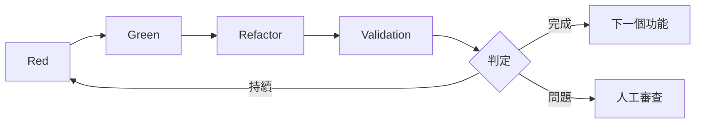

# 3.5 Validation 步驟詳解

## Validation 的角色

Validation 是 AITDD 相較於傳統 TDD 的最大革新之一。透過在 Red-Green-Refactor 循環後加入此步驟，可以自動化品質檢查與完結判定，確保 AI 產出的程式碼符合標準。

## 主要目標

1. **多層品質把關**  
   - 功能要求是否達成  
   - 是否避免回歸問題  
   - 程式碼是否維持良好結構

2. **自動化完結判定**  
   - 以客觀標準決定是否可結案  
   - 在人工審查前先過濾問題  
   - 持續監控品質

3. **回饋流程優化**  
   - 了解 AI 產出品質的趨勢  
   - 收集資料以改善提示與流程  
   - 量測開發效率並優化

## Validation 的時機



## 執行步驟

### 1. 確認所有現有測試為綠燈

```bash
$ npm test
✅ 所有測試通過
Tests: 6 passed, 6 total
Coverage: 94%
```
若有失敗，需先找出原因（程式更動、資料衝突、環境問題）並修正後再進行。

### 2. 檢視需求與測試文件

需比對以下文件：
- `docs/implements/{{task_id}}/{feature_name}-requirements.md`
- `docs/implements/{{task_id}}/{feature_name}-testcases.md`
- `docs/todo.md`
- 其他相關文件（如 architecture、memo 等）

### 3. 確認測試案例實作狀態

檢查測試檔案是否涵蓋 `testcases.md` 內的項目，並統計完成情況，例如：
- 已實作：TC001～TC007、TC010
- 未實作：TC008（流量限制）、TC009（DB 故障）
- 實作率：80%

### 4. 分析品質並判斷 TODO 更新

AI 可生成報告評估：
- 未實作項目的重要度與優先順序
- 已完成項目的風險狀態
- 需要補強的項目與建議行動

## 判斷標準

### ✅ 完成（可自動前進）
- 現有測試全通過
- 測試案例實作率 ≥ 90%
- 重要需求 100% 達成
- 安全檢查無重大議題
- 其他品質指標合格（coverage、lint、複雜度等）

### ⚠️ 持續（需補實作）
- 測試未通過  
- 實作率不足  
- 重要需求未完成  
- 品質指標未達標

### 🔍 要審查（人工判斷）
- 介於閾值附近或牽涉商業判斷  
- 安全或效能要求需與團隊討論  
- 影響範圍不易由 AI 判定

## AI 判定流程

### 1. 蒐集與分析資料
- 測試結果、覆蓋率、靜態分析、效能數據
- 需求、測試規格、架構設計
- 既有系統與環境設定資料

### 2. 逐層判定邏輯
1. 致命問題：測試失敗、重大資安風險、資料破壞  
2. 重要功能：必備功能是否缺漏  
3. 品質指標：覆蓋率、複雜度等是否達標  
4. 綜合判斷：依組織標準給出結果

### 3. 建議輸出格式
```json
{
  "判定結果": "完結|持續|人工判斷",
  "實作率": {"測試案例": "80%", "重要功能": "100%"},
  "品質評估": {"安全": "注意", "效能": "普通", "保守性": "高"},
  "未完成項目": [{"項目": "TC009", "重要度": "高", "建議": "立即補實作"}]
}
```

## 信號燈（Traffic Light）標示

- 🟢 高信心：文件明確記載，可直接採信
- 🟡 中信心：AI 推測合理，但仍建議人工確認
- 🔴 低信心：純推測，必須人工判斷

可搭配 TODO 清單列出：
```markdown
### 🟢 必查
- [ ] 確認 TC001～TC007、TC010 的實作

### 🟡 建議查
- [ ] 確認效能與安全性評估是否符合規格

### 🔴 必須人工決策
- [ ] 判斷流量限制是否可延後實作
```

## 最佳化建議

1. **持續優化提示**：明確列出判定標準、提供完整背景、統一輸出格式。  
2. **擴充自動化範圍**：持續累積資料，學習組織特有的判準。  
3. **定期檢視基準**：避免過度嚴苛或過度寬鬆，維持效率與品質平衡。

## 常見問題

| 問題 | 可能原因 | 解法 |
|------|-----------|------|
| 判定不一致 | 基準模糊 | 數字化標準、文件化規則 |
| 要判斷太多 | AI 精準度不足 | 改善提示、累積案例、調整閾值 |
| 永遠沒完沒了 | 要求過度嚴格 | 設計多層標準、依風險調整 |

## 總結

透過 Validation：
- 品質有明確標準  
- 人工審查更聚焦  
- 流程可持續改善

下一步請前往 [第 4 章：實作演練](../04-hands-on/01-first-project.md)，在實際專案中體驗 Validation 的威力。
