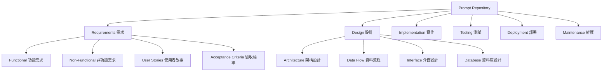
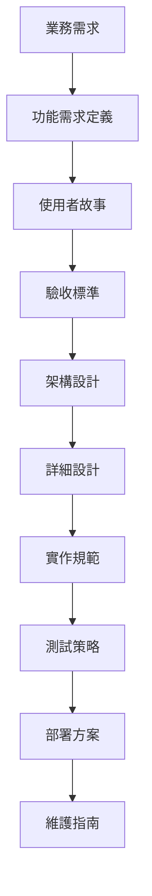
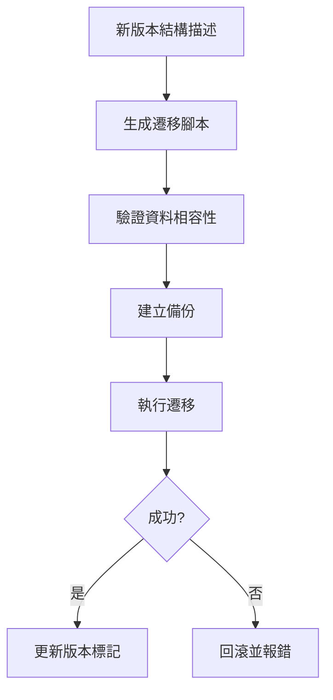
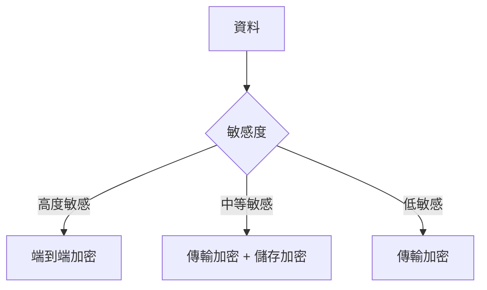
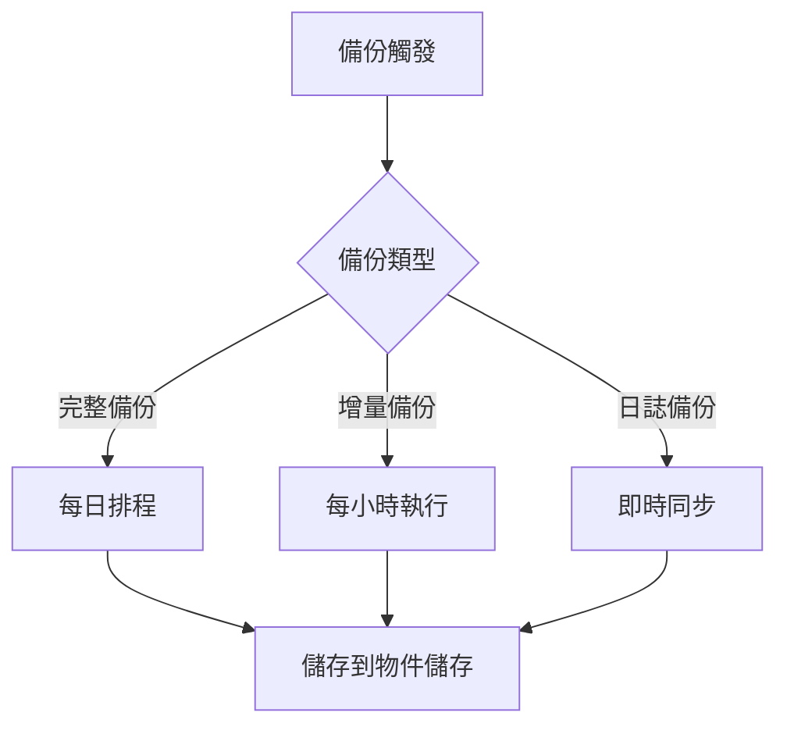

# prompt-repo-sdd-tdd 內容結構設計

## Prompt 內容組織策略

設計一個結構化的內容管理系統，以 Markdown 文件為核心，使用目錄結構和元資料進行組織，完全依賴 Git 進行版本控制和協作。

**信賴等級**：🔵 確定（基於架構設計）

## 內容分類架構

### 主要分類結構


**組織原則**：
- **功能導向**：按開發階段進行分類
- **漸進細化**：從需求到實作的邏輯順序
- **模組化**：每個分類可獨立維護和更新

### 內容關聯結構


**關聯類型**：
- **依賴關聯**：後續階段依賴前置階段
- **參考關聯**：跨階段的內容參考
- **組合關聯**：多個 prompt 的組合使用

**評分標準**：
- **功能匹配度** (0.3)：滿足資料操作需求
- **效能表現** (0.25)：讀寫效能和延遲
- **擴展性** (0.2)：水平/垂直擴展能力
- **成本效益** (0.15)：總擁有成本
- **運維複雜度** (0.1)：部署和維護難度

## 資料模型設計

### 通用核心實體
```typescript
interface BaseEntity {
  id: string;
  createdAt: Date;
  updatedAt: Date;
  version: number;
  metadata: Record<string, any>;
}

interface Project extends BaseEntity {
  name: string;
  type: ProjectType;
  description: string;
  status: ProjectStatus;
  requirements: Requirement[];
  design: DesignDocument[];
  tasks: Task[];
}

interface Requirement extends BaseEntity {
  projectId: string;
  type: 'functional' | 'non-functional';
  title: string;
  description: string;
  priority: 'high' | 'medium' | 'low';
  status: 'draft' | 'approved' | 'implemented';
}

interface DesignDocument extends BaseEntity {
  projectId: string;
  type: 'architecture' | 'dataflow' | 'interfaces' | 'database' | 'api';
  title: string;
  content: string;
  format: 'markdown' | 'typescript' | 'yaml' | 'json';
  version: string;
}
```

### 專案類型特定的擴展

#### Web API 專案資料模型
```typescript
interface WebApiProject extends Project {
  apiEndpoints: ApiEndpoint[];
  databaseSchema: DatabaseSchema;
  authentication: AuthConfiguration;
  rateLimiting: RateLimitConfig;
}

interface ApiEndpoint {
  path: string;
  method: string;
  description: string;
  requestSchema: Schema;
  responseSchema: Schema;
  authentication: boolean;
}
```

#### Data Science 專案資料模型
```typescript
interface DataScienceProject extends Project {
  datasets: Dataset[];
  experiments: Experiment[];
  models: MLModel[];
  pipelines: Pipeline[];
}

interface Dataset {
  name: string;
  format: string;
  location: string;
  schema: Schema;
  size: number;
  lastModified: Date;
}

interface Experiment {
  name: string;
  parameters: Record<string, any>;
  metrics: Record<string, number>;
  status: 'running' | 'completed' | 'failed';
  artifacts: Artifact[];
}
```

#### AI/ML 專案資料模型
```typescript
interface AIMLProject extends Project {
  trainingJobs: TrainingJob[];
  models: MLModel[];
  datasets: Dataset[];
  evaluations: ModelEvaluation[];
}

interface TrainingJob {
  modelId: string;
  datasetId: string;
  parameters: Record<string, any>;
  status: 'pending' | 'running' | 'completed' | 'failed';
  metrics: Record<string, number>;
  artifacts: Artifact[];
}

interface ModelEvaluation {
  modelId: string;
  datasetId: string;
  metrics: Record<string, number>;
  confusionMatrix?: number[][];
  featureImportance?: Record<string, number>;
}
```

## 資料遷移與版本控制

### 結構描述版本管理


**遷移策略**：
- **增量遷移**：只遷移必要的變更
- **零停機部署**：支援滾動升級
- **資料驗證**：遷移後資料完整性檢查
- **回滾計劃**：失敗時的恢復機制

### 資料版本控制
```typescript
interface DataVersion {
  entityId: string;
  version: number;
  timestamp: Date;
  changes: ChangeRecord[];
  author: string;
  reason: string;
}

interface ChangeRecord {
  field: string;
  oldValue: any;
  newValue: any;
  changeType: 'add' | 'update' | 'delete';
}
```

## 效能優化策略

### 查詢優化
- **索引策略**：根據查詢模式設計索引
- **快取層次**：應用層、資料庫層、分散式快取
- **讀寫分離**：主從複製架構
- **分片策略**：資料水平分割

### 儲存優化
- **資料壓縮**：根據資料類型選擇壓縮演算法
- **儲存分層**：熱資料、溫資料、冷資料分層儲存
- **備份策略**：增量備份和災難恢復
- **清理策略**：過期資料自動清理

## 安全性設計

### 資料加密策略


**加密層級**：
- **靜態加密**：資料庫層面的透明加密
- **傳輸加密**：TLS 1.3 加密通訊
- **應用加密**：敏感欄位額外加密

### 存取控制
```typescript
interface AccessPolicy {
  resource: string;
  action: 'read' | 'write' | 'delete' | 'admin';
  principal: string;
  conditions: PolicyCondition[];
  effect: 'allow' | 'deny';
}

interface PolicyCondition {
  type: 'time' | 'ip' | 'role' | 'attribute';
  operator: string;
  value: any;
}
```

**存取控制模型**：
- **角色-based 存取控制 (RBAC)**：角色定義權限
- **屬性-based 存取控制 (ABAC)**：動態權限評估
- **最小權限原則**：預設拒絕，明確授權

## 監控與觀測

### 資料庫效能指標
- **查詢效能**：響應時間、吞吐量、慢查詢
- **資源使用**：CPU、記憶體、磁碟 I/O
- **連線狀態**：活躍連線、連線池使用率
- **錯誤率**：連線錯誤、查詢錯誤

### 資料品質指標
- **完整性**：資料完整性約束檢查
- **一致性**：跨表資料一致性驗證
- **準確性**：資料驗證規則檢查
- **及時性**：資料更新時效性監控

## 備份與災難恢復

### 備份策略


**備份頻率**：
- **完整備份**：每日凌晨執行
- **增量備份**：每小時執行
- **交易日誌**：即時備份
- **關鍵資料**：即時複製

### 災難恢復計劃
- **RTO (Recovery Time Objective)**：服務恢復時間目標
- **RPO (Recovery Point Objective)**：資料恢復點目標
- **多區域部署**：跨區域容災
- **自動故障轉移**：服務自動切換

## 擴展性設計

### 水平擴展策略
- **資料分片**：根據業務邏輯分片
- **讀寫分離**：讀負載分散到多個副本
- **快取擴展**：分散式快取叢集
- **服務拆分**：微服務架構支援

### 垂直擴展策略
- **資源升級**：CPU、記憶體、儲存擴容
- **效能優化**：查詢優化、索引優化
- **架構升級**：採用更高效能的儲存方案
- **快取優化**：記憶體快取和應用快取

## 合規性考量

### 資料隱私保護
- **GDPR 合規**：個人資料處理要求
- **資料最小化**：只收集必要資料
- **同意管理**：使用者資料使用同意
- **權利行使**：資料存取、更正、刪除權利

### 業界標準遵循
- **資料安全標準**：ISO 27001、SOC 2
- **金融服務**：PCI DSS（支付卡資料安全標準）
- **醫療資料**：HIPAA（健康保險流通與責任法案）
- **一般資料保護**：GDPR、CCPA

## 快取策略

### 記憶體快取
```typescript
interface CacheEntry {
  key: string;
  data: any;
  timestamp: Date;
  ttl: number;
}
```

### 檔案快取
- **位置**：`.cache/` 目錄
- **內容**：頻繁存取的解析結果和中間資料
- **清理**：基於 LRU 演算法和檔案大小限制

## 資料一致性

### 檔案系統一致性
- **原子操作**：使用臨時檔案 + 移動操作確保一致性
- **錯誤恢復**：操作失敗時自動清理臨時檔案

### GitHub API 一致性
- **重試機制**：網路錯誤時自動重試
- **衝突解決**：偵測並處理並發操作衝突
- **離線支援**：網路中斷時的本地操作記錄

## 備份與恢復

### 自動備份
- **Git 提交**：每次重要操作自動提交到 Git
- **分支策略**：功能分支隔離，main 分支穩定

### 災難恢復
- **資料重建**：從 Git 歷史重建所有文件
- **Issue 同步**：從 GitHub API 重新同步 Issue 狀態
- **設定恢復**：從環境變數和設定檔案重建配置

## 擴展性考量

### 未來資料庫整合
如果系統規模擴大，可以考慮：

1. **SQLite**：輕量級本地資料庫
2. **PostgreSQL**：支援複雜查詢和關聯
3. **混合模式**：檔案系統 + 資料庫並存

### 遷移策略
- **漸進式遷移**：保持向後相容
- **資料匯出**：提供標準格式的資料匯出功能
- **雙寫模式**：同時寫入新舊儲存系統

## 效能優化

### 索引策略
- **檔案路徑索引**：快速定位文件
- **內容索引**：支援文件內容搜尋
- **元資料索引**：檔案屬性和時間戳記

### 查詢優化
- **分頁載入**：大型文件按需載入
- **預載入**：預測性載入相關文件
- **壓縮儲存**：對大型文件進行壓縮

## 監控與維護

### 儲存空間監控
- **檔案大小追蹤**：監控專案總大小
- **清理策略**：自動清理舊的快取和臨時檔案

### 效能監控
- **讀寫效能**：追蹤檔案操作時間
- **快取命中率**：監控快取效果
- **GitHub API 使用量**：追蹤 API 呼叫頻率