# prompt-repo-sdd-tdd 資料流程設計

## 系統資料流程總覽

### 主要資料流程
```
需求分析
    ↓
Prompt 設計
    ↓
Markdown 文件
    ↓
Git 版本控制
    ↓
分類組織
    ↓
使用應用
```

**信賴等級**：🔵 確定（基於架構設計）

## 核心資料流程

### 1. Prompt 創建流程

#### 需求到 Prompt 的轉換
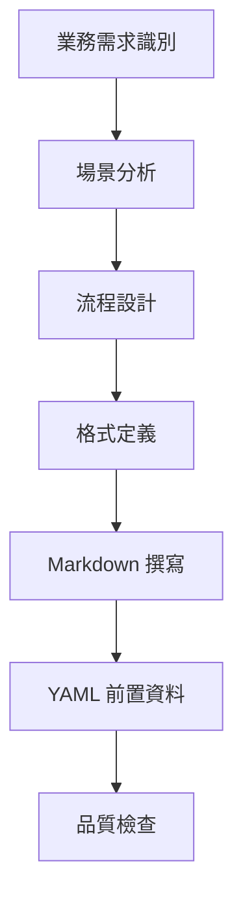

**資料轉換**：
- **輸入**：業務需求和使用場景
- **處理**：結構化 prompt 設計
- **輸出**：標準化 Markdown 文件

#### Prompt 內容組織流程
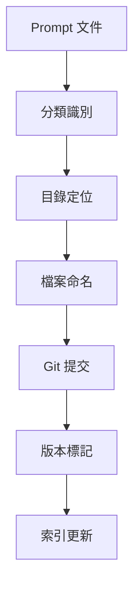

**資料轉換**：
- **輸入**：完成的 prompt 文件
- **處理**：目錄結構化組織
- **輸出**：可搜索的 prompt 庫

### 2. Prompt 使用流程

#### 查找與應用流程
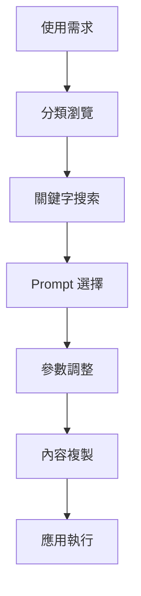

**資料轉換**：
- **輸入**：具體的使用情境
- **處理**：prompt 匹配和適配
- **輸出**：可執行的 prompt 實例

### 3. 版本控制流程

#### Git 工作流程
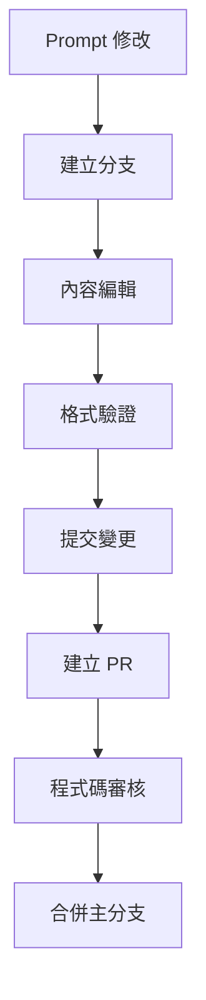

**資料轉換**：
- **輸入**：prompt 改進需求
- **處理**：協作式版本控制
- **輸出**：更新的 prompt 版本

## 資料格式標準

### Markdown 文件格式
```yaml
# 文件結構
frontmatter: YAML 元資料
content: Markdown 內容
```

### YAML Frontmatter 格式
```yaml
title: string          # Prompt 標題
description: string    # 詳細描述
category: string       # 分類路徑
version: string        # 版本號
author: string         # 作者
tags: string[]         # 標籤列表
parameters: object[]   # 參數定義
```

### 目錄結構格式
```
repository/
├── category1/
│   ├── prompt1.md
│   └── prompt2.md
└── category2/
    ├── subcategory/
    │   └── prompt3.md
    └── prompt4.md
```

## 品質保證流程

### 自動驗證流程
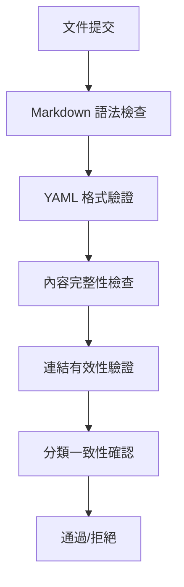

### 人工審核流程
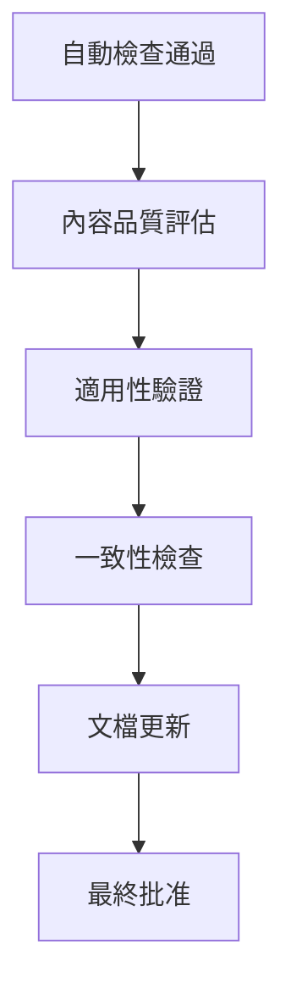

## 效能優化設計

### 搜索優化
- **標籤索引**：基於 YAML tags 的快速搜索
- **分類導航**：目錄結構化的瀏覽體驗
- **全文搜索**：內容關鍵字匹配

### 版本控制優化
- **增量提交**：只提交變更內容
- **分支策略**：功能分支隔離開發
- **合併管理**：清晰的變更追蹤

### 維護便利性
- **模板化**：標準化的 prompt 結構
- **參數化**：靈活的內容適配
- **模組化**：可組合的 prompt 組件
    A[結構化需求] --> B[特徵提取]
    B --> C[模式匹配]
    C --> D[相似度計算]
    D --> E[類型分類]
    E --> F[信心度評估]
    F --> G{信心度 > 閾值?}
    G -->|是| H[確定專案類型]
    G -->|否| I[請求使用者確認]
```

**決策邏輯**：
- **特徵權重**：技術關鍵字 (0.4) > 架構偏好 (0.3) > 規模指標 (0.2) > 團隊技能 (0.1)
- **相似度演算法**：餘弦相似度 + TF-IDF
- **信心閾值**：0.75（可設定）

### 2. 設計生成流程

#### 自適應設計策略選擇
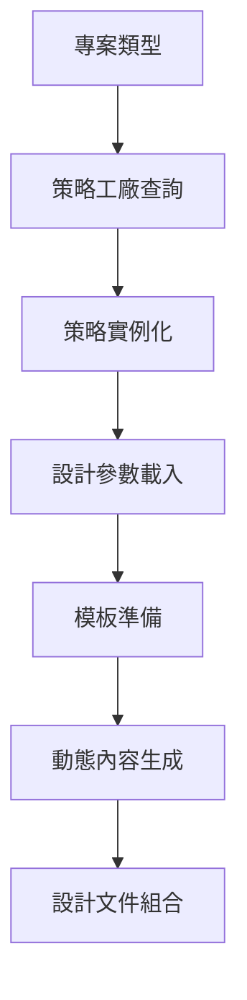

**策略模式實作**：
```typescript
interface DesignStrategy {
  analyzeRequirements(requirements: Requirements): Promise<AnalysisResult>;
  selectArchitecturePattern(): ArchitecturePattern;
  recommendTechnologyStack(): TechnologyStack;
  generateDesignDocuments(): DesignDocument[];
  validateDesign(): ValidationResult;
}
```

#### 技術棧智慧推薦
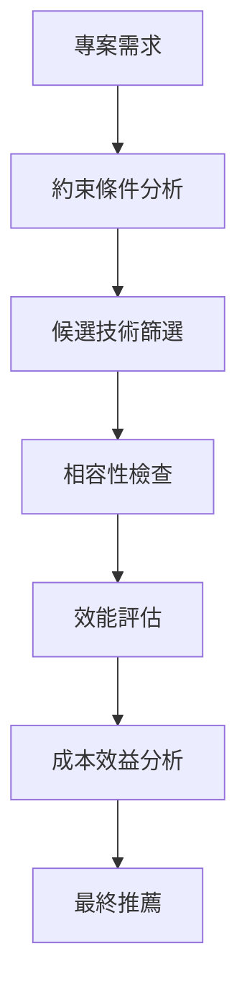

**評分演算法**：
- **技術成熟度** (0.25)：採用率、社群支援、文件完整性
- **專案適配度** (0.30)：功能匹配、架構相容性
- **團隊適應性** (0.20)：學習曲線、既有技能匹配
- **維護成本** (0.15)：授權費用、部署複雜度
- **未來擴展性** (0.10)：生態系統活躍度、更新頻率

### 3. 文件生成與管理流程

#### 多格式設計文件生成
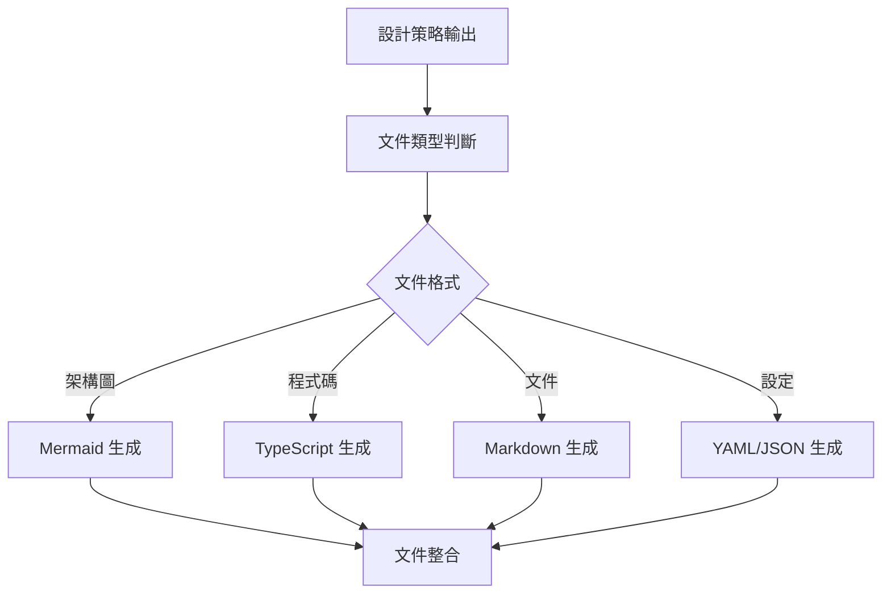

**支援的文件格式**：
- **架構圖**：Mermaid (flowchart, sequence, class diagrams)
- **介面定義**：TypeScript declaration files
- **設計文件**：Markdown with embedded diagrams
- **配置檔案**：YAML/JSON for CI/CD, deployment
- **測試案例**：Jest/Mocha test files

#### 版本控制與變更追蹤
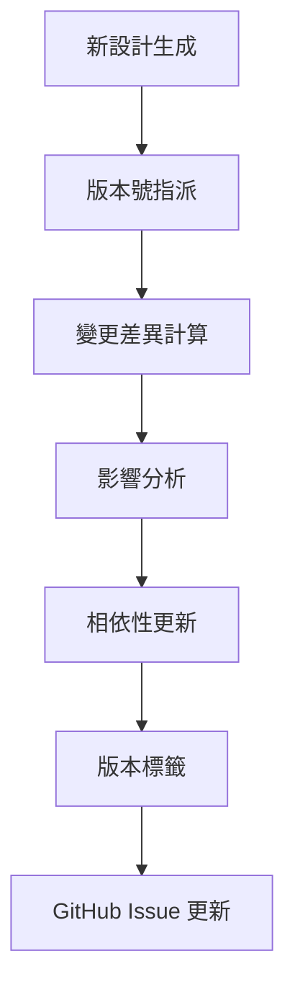

**版本管理策略**：
- **語意版本**：MAJOR.MINOR.PATCH
- **設計版本**：與軟體版本分離管理
- **變更追蹤**：詳細記錄設計決策和理由

## 專案類型特定的資料流程

### Web API 專案資料流程
```
使用者請求 → API Gateway → 認證服務 → 業務邏輯 → 資料存取 → 回應格式化
     ↓           ↓           ↓           ↓           ↓           ↓
  負載平衡   請求路由    Token 驗證  服務調用   資料庫查詢  JSON 序列化
```

**關鍵資料轉換**：
- **請求解析**：HTTP → 結構化物件
- **業務處理**：同步/非同步處理邏輯
- **資料映射**：ORM 物件 ↔ 資料庫記錄
- **回應生成**：業務物件 → API 回應格式

### Python Package 專案資料流程
```
原始資料 → 資料驗證 → 資料處理 → 核心演算法 → 結果輸出
     ↓           ↓           ↓           ↓           ↓
  格式檢查   類型轉換   資料清理   計算邏輯   輸出格式化
```

**資料處理管線**：
- **輸入驗證**：參數類型和範圍檢查
- **資料轉換**：格式標準化和清理
- **處理邏輯**：核心功能實作
- **輸出驗證**：結果格式和正確性檢查

### Data Science 專案資料流程
```
原始資料 → 資料探索 → 特徵工程 → 模型訓練 → 模型驗證 → 預測服務
     ↓           ↓           ↓           ↓           ↓           ↓
  資料載入   EDA 分析   特徵提取   演算法選擇  交叉驗證   API 部署
```

**ML 管線設計**：
- **資料準備**：ETL 流程和資料品質檢查
- **特徵工程**：自動化特徵生成和選擇
- **模型訓練**：超參數調優和模型選擇
- **驗證部署**：A/B 測試和效能監控

### AI/ML 專案資料流程
```
訓練資料 → 資料預處理 → 模型架構設計 → 訓練執行 → 模型優化 → 推論服務
     ↓           ↓           ↓           ↓           ↓           ↓
  資料管道   特徵工程   神經網路設計  GPU 訓練   量化壓縮   REST API
```

**MLOps 資料流程**：
- **資料版本控制**：DVC 或 Pachyderm
- **實驗追蹤**：MLflow 或 Weights & Biases
- **模型註冊**：Model Registry with versioning
- **推論優化**：ONNX, TensorRT 優化

## 資料儲存與管理策略

### 多層次快取策略
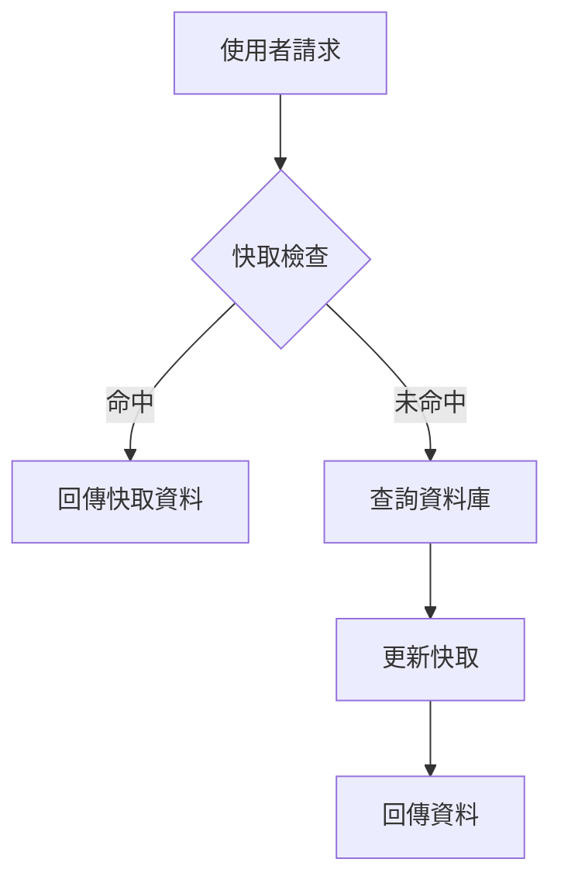

**快取層級**：
- **L1 快取**：應用程式內記憶體快取 (Redis)
- **L2 快取**：分散式快取 (Memcached)
- **L3 快取**：CDN 快取 (CloudFlare)

### 資料持久化策略
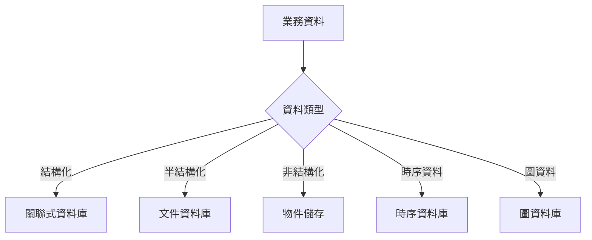

**儲存技術選擇**：
- **PostgreSQL**：複雜查詢和 ACID 事務
- **MongoDB**：靈活的 JSON 文件儲存
- **S3/ GCS**：大檔案和媒體內容
- **InfluxDB**：時間序列資料和指標
- **Neo4j**：圖資料和關係查詢

## 錯誤處理與恢復流程

### 異常處理策略
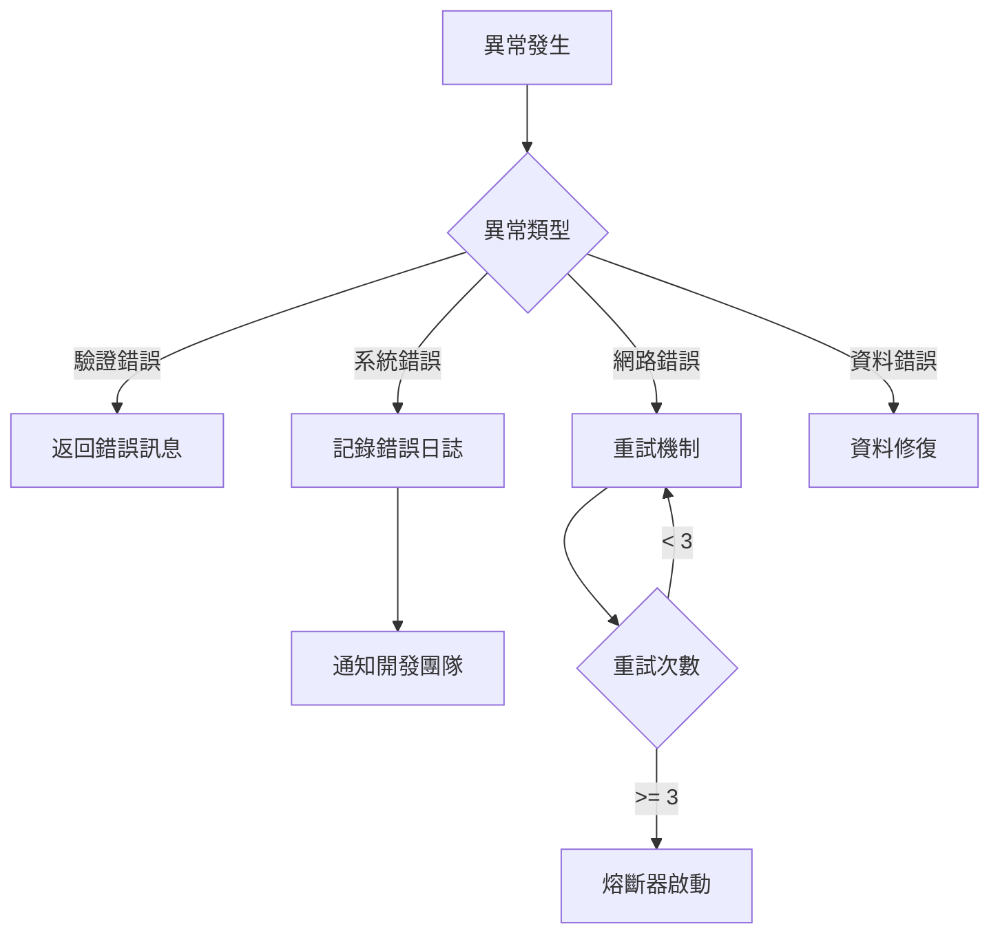

**錯誤分類**：
- **使用者錯誤**：輸入驗證失敗，立即返回錯誤
- **系統錯誤**：記錄詳細日誌，通知維護團隊
- **暫時性錯誤**：實作指數退避重試機制
- **永久性錯誤**：觸發熔斷器，保護系統穩定

### 資料一致性保障
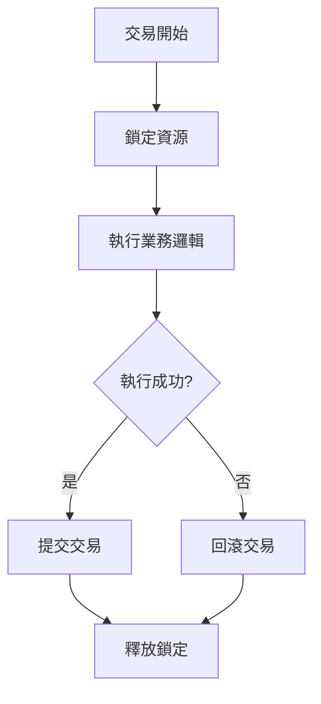

**一致性等級**：
- **強一致性**：ACID 事務，立即可見
- **最終一致性**：BASE 模式，允許暫時不一致
- **因果一致性**：有因果關係的操作保持一致

## 效能優化策略

### 資料處理優化
- **批次處理**：減少資料庫連接開銷
- **非同步處理**：提高系統響應性
- **資料壓縮**：減少網路傳輸和儲存成本
- **索引優化**：提高查詢效能

### 快取策略優化
- **快取預熱**：系統啟動時載入熱點資料
- **智慧失效**：基於存取模式調整快取策略
- **分散式快取**：支援水平擴展
- **快取一致性**：確保資料同步

## 監控與觀測資料流程

### 應用程式指標收集
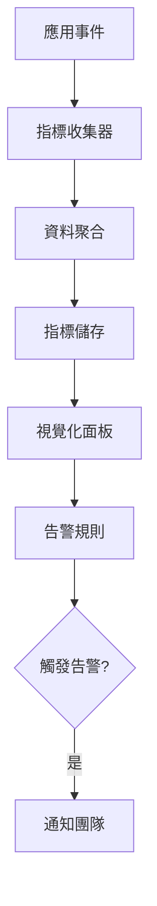

**關鍵指標**：
- **效能指標**：響應時間、吞吐量、錯誤率
- **資源指標**：CPU、記憶體、磁碟使用率
- **業務指標**：使用者活躍度、轉換率
- **品質指標**：測試覆蓋率、程式碼品質

### 日誌聚合與分析
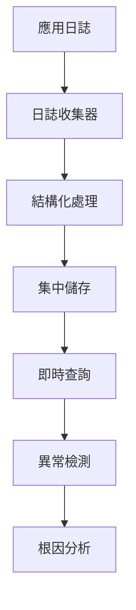

**日誌管理策略**：
- **結構化日誌**：統一格式，便於搜尋和分析
- **日誌等級**：DEBUG, INFO, WARN, ERROR
- **日誌輪轉**：防止磁碟空間耗盡
- **分散式追蹤**：請求追蹤和效能分析
    participant G as 文件生成器

    U->>C: 輸入自然語言需求
    C->>P: 解析需求
    P->>V: 驗證完整性

    alt 需求不完整
        V-->>C: 要求釐清問題
        C-->>U: 顯示問題
        U->>C: 提供更多資訊
        C->>P: 更新需求
    end

    V-->>G: 需求確認
    G-->>C: 生成 EARS 文件
    C-->>U: 顯示結果
```

## GitHub Issue 管理流程

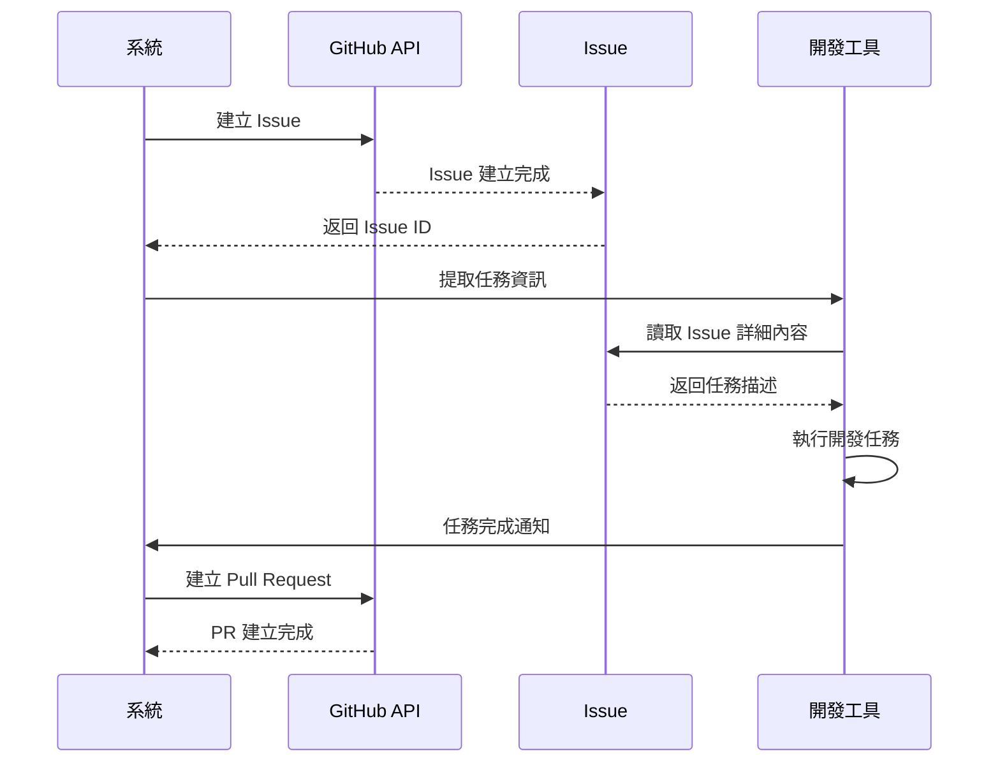

## 多工具整合流程

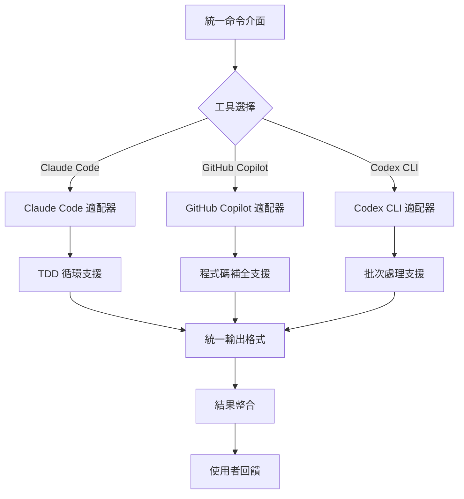

## 資料儲存流程

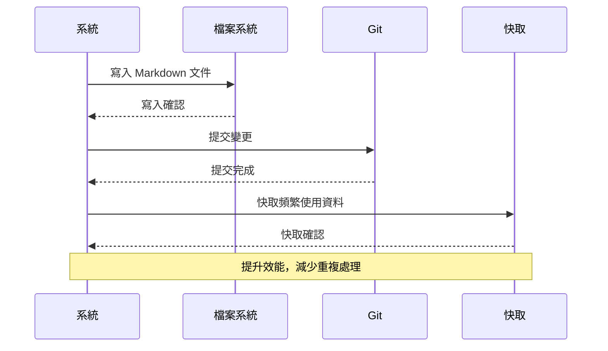

## 錯誤處理流程

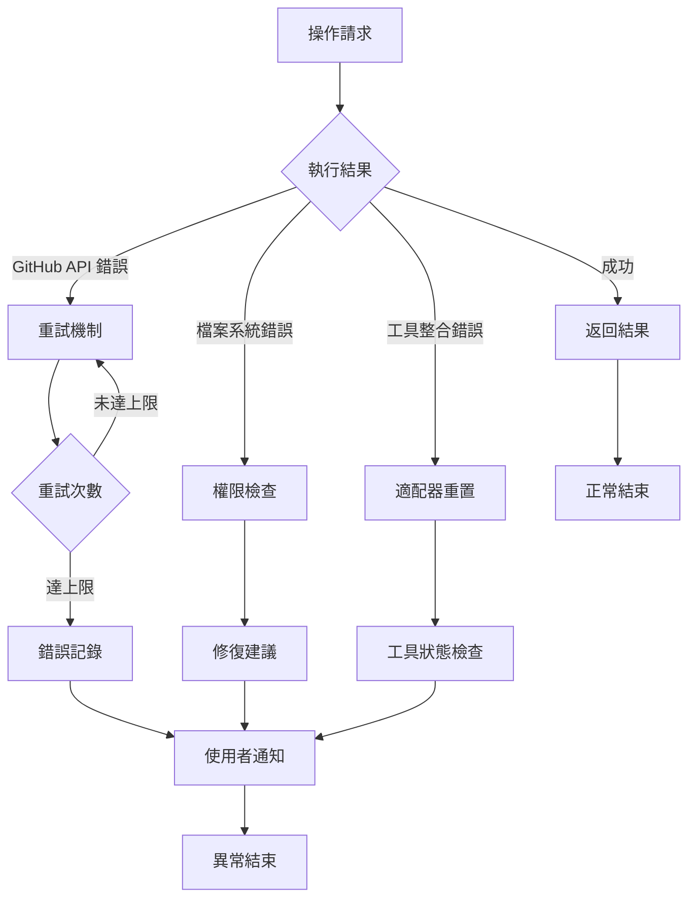