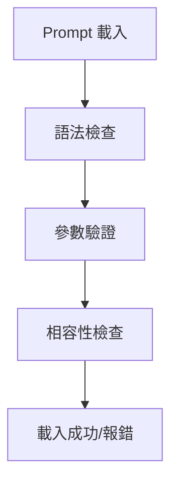
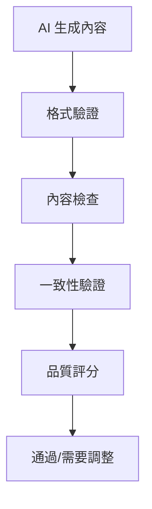

# Prompt 整合模式

## 概述

定義 prompt 與各種 AI 工具和開發平台的整合模式，提供統一的使用體驗和最佳實務。

**信賴等級**：🔵 確定（基於架構設計）

## AI 工具整合模式

### Claude Code 整合

#### 專案初始化模式
```markdown
# 使用場景：新專案開始時
1. 複製對應的初始化 prompt 到專案目錄
2. 在 Claude Code 中載入 prompt
3. 執行結構化需求訪談
4. 生成專案基礎結構
```

**整合步驟**：
1. **Prompt 載入**：將 Markdown prompt 複製到 `.claude/prompts/` 目錄
2. **參數設定**：根據專案類型調整 YAML frontmatter 參數
3. **執行流程**：按照 prompt 的階段性指導執行
4. **輸出處理**：將生成的文檔儲存到適當位置

#### 持續開發模式
```markdown
# 使用場景：專案開發過程中
1. 根據開發階段選擇對應 prompt
2. 載入當前狀態資訊
3. 執行階段性任務
4. 更新專案狀態
```

### GitHub Copilot 整合

#### 程式碼生成模式
```markdown
# 使用場景：需要生成特定程式碼時
1. 選擇對應的實作 prompt
2. 在編輯器中提供上下文
3. 使用 Copilot 應用 prompt 指導
4. 驗證和調整生成的程式碼
```

**整合特點**：
- **即時補全**：在編寫程式碼時提供符合 prompt 規範的建議
- **函數生成**：根據設計 prompt 生成完整函數
- **測試生成**：自動生成符合測試策略的測試程式碼

### Cursor 整合

#### 互動式開發模式
```markdown
# 使用場景：需要 AI 協助的開發任務
1. 載入相關 prompt 作為系統指令
2. 通過聊天介面進行需求討論
3. 讓 AI 生成程式碼和文檔
4. 進行即時修改和優化
```

**整合優勢**：
- **上下文感知**：AI 理解整個專案的開發脈絡
- **多輪對話**：支援複雜需求的逐步釐清
- **即時回饋**：快速驗證和調整生成內容

## 整合模式分類

### 直接載入模式
```yaml
# 適用場景：標準化任務
integration:
  mode: "direct-load"
  platform: "claude-code"
  trigger: "manual"
  parameters:
    auto_apply: true
    validation: "strict"
```

**特點**：
- 一次性載入完整 prompt
- 自動執行標準化流程
- 適用於重複性任務

### 互動式整合模式
```yaml
# 適用場景：複雜或創意任務
integration:
  mode: "interactive"
  platform: "cursor"
  trigger: "context-aware"
  parameters:
    conversation_mode: true
    iterative_refinement: true
```

**特點**：
- 支援多輪對話
- 動態調整 prompt 參數
- 適用於探索性任務

### 混合整合模式
```yaml
# 適用場景：大型專案開發
integration:
  mode: "hybrid"
  platforms: ["claude-code", "github-copilot"]
  trigger: "phase-based"
  parameters:
    phase_detection: true
    cross_platform_sync: true
```

**特點**：
- 多工具協同工作
- 階段性自動切換
- 適用於完整開發流程

## 參數化整合

### 動態參數映射
```yaml
# Prompt 參數到工具參數的映射
parameter_mapping:
  complexity: "ai.temperature"  # 複雜度映射到 AI 溫度
  domain: "context.filter"     # 領域映射到上下文過濾
  style: "code.format"         # 風格映射到程式碼格式
```

### 環境適配
```yaml
# 根據不同環境自動調整參數
environment_adaptation:
  development:
    verbosity: "detailed"
    validation: "strict"
  production:
    verbosity: "concise"
    validation: "essential"
```

## 品質保證整合

### 自動驗證整合


### 輸出驗證整合


## 最佳實務

### 整合準備
1. **環境設定**：確保 AI 工具正確安裝和配置
2. **權限確認**：驗證必要的 API 存取權限
3. **網路連線**：確保穩定網路連接（如果需要）

### 使用流程
1. **需求分析**：評估任務複雜度和適用工具
2. **Prompt 選擇**：根據任務類型選擇最適合的 prompt
3. **參數調整**：根據具體情境調整 prompt 參數
4. **執行監控**：觀察 AI 工具的執行過程和輸出
5. **結果驗證**：檢查生成內容是否符合品質標準

### 問題處理
1. **載入失敗**：檢查 prompt 格式和參數設定
2. **輸出異常**：調整 prompt 參數或選擇不同工具
3. **效能問題**：優化 prompt 複雜度或分割任務
4. **一致性問題**：使用標準化的 prompt 模板

## 擴展支援

### 新工具整合
```yaml
# 新增工具支援的標準流程
new_tool_integration:
  1: "分析工具 API 和功能"
  2: "設計參數映射策略"
  3: "實作整合介面卡"
  4: "測試整合效果"
  5: "更新文檔和範例"
```

### 自訂整合模式
```yaml
# 團隊特定的整合配置
custom_integration:
  team_rules:
    - "統一使用特定 AI 模型版本"
    - "標準化 prompt 參數命名"
    - "建立共用 prompt 庫"
  workflow_enhancements:
    - "自動品質檢查"
    - "團隊審核流程"
    - "使用統計追蹤"
```

## 效能優化

### 快取策略
- **Prompt 快取**：重複使用的 prompt 進行本地快取
- **參數快取**：常用參數組合的預設值
- **結果快取**：相似任務的歷史結果參考

### 並行處理
- **多任務並行**：獨立任務的同時處理
- **階段流水線**：開發流程各階段的並行執行
- **工具分流**：不同類型任務分配給最適合的工具

### 資源管理
- **記憶體優化**：控制 prompt 大小和複雜度
- **網路優化**：減少不必要的 API 呼叫
- **儲存優化**：有效率的輸出格式和壓縮
```

#### POST /repos/{owner}/{repo}/issues
**建立新 Issue**

請求：
```json
{
  "title": "[新功能] 用戶註冊功能",
  "body": "## 需求描述\n使用者需要能夠註冊帳號...\n\n## 驗收標準\n- [ ] 註冊表單\n- [ ] 驗證機制",
  "labels": ["enhancement", "high-priority"],
  "assignees": ["developer"]
}
```

回應：
```json
{
  "id": 123456,
  "number": 42,
  "title": "[新功能] 用戶註冊功能",
  "html_url": "https://github.com/owner/repo/issues/42"
}
```

#### PATCH /repos/{owner}/{repo}/issues/{issue_number}
**更新 Issue**

請求：
```json
{
  "state": "closed",
  "body": "## 需求描述\n...\n\n## 實作完成\n✅ 註冊表單\n✅ 驗證機制"
}
```

### Pull Request 管理

#### POST /repos/{owner}/{repo}/pulls
**建立 Pull Request**

請求：
```json
{
  "title": "feat: 實作用戶註冊功能",
  "head": "feature/user-registration",
  "base": "main",
  "body": "## 變更內容\n- 新增註冊表單元件\n- 實作驗證邏輯\n\n## 相關 Issue\nCloses #42",
  "draft": false
}
```

#### GET /repos/{owner}/{repo}/pulls/{pull_number}/merge
**檢查 PR 合併狀態**

回應：
```json
{
  "merged": true,
  "message": "Successfully merged"
}
```

## 開發工具整合介面

### Claude Code 整合

#### 命令列介面
```bash
# 啟動 Claude Code 並載入專案
claude --project /path/to/project

# 執行 TDD 循環
/test                # 執行測試
/implement           # 實作功能
/refactor           # 重構程式碼
```

#### 回應格式
```json
{
  "command": "test",
  "result": "success",
  "output": "All tests passed",
  "duration": 1250
}
```

### GitHub Copilot 整合

#### VS Code 擴展 API
```typescript
// 程式碼補全請求
interface CompletionRequest {
  prompt: string;
  language: string;
  context: string;
  position: {
    line: number;
    character: number;
  };
}

// 補全回應
interface CompletionResponse {
  completions: Array<{
    text: string;
    score: number;
    documentation?: string;
  }>;
}
```

#### 測試案例生成
```typescript
interface TestGenerationRequest {
  code: string;
  language: string;
  framework: string;
  coverage: number;
}
```

### Codex CLI 整合

#### 批次處理介面
```bash
# 批次處理多個檔案
codex process --files "*.ts" --output results.json

# 程式碼分析
codex analyze --file src/app.ts --rules eslint,reliability
```

#### 批次處理結果
```json
{
  "files_processed": 15,
  "total_lines": 1250,
  "issues_found": 3,
  "results": [
    {
      "file": "src/app.ts",
      "line": 42,
      "rule": "security",
      "message": "Potential XSS vulnerability"
    }
  ]
}
```

## 內部 API 介面

### 需求解析 API

#### POST /api/requirements/parse
**解析自然語言需求**

請求：
```json
{
  "input": "我想要一個線上購物網站，讓顧客能瀏覽商品、下訂單、付款",
  "language": "zh-TW",
  "context": {
    "domain": "e-commerce",
    "complexity": "medium"
  }
}
```

回應：
```json
{
  "success": true,
  "data": {
    "intent": {
      "type": "feature",
      "category": "e-commerce",
      "description": "線上購物平台"
    },
    "clarificationQuestions": [
      "支援哪些付款方式？",
      "需要會員系統嗎？"
    ]
  }
}
```

### 文件生成 API

#### POST /api/documents/generate
**生成 SDD/TDD 文件**

請求：
```json
{
  "type": "sdd",
  "requirements": {
    "functional": [...],
    "nonFunctional": [...]
  },
  "template": "default",
  "language": "zh-TW"
}
```

回應：
```json
{
  "success": true,
  "data": {
    "documentId": "sdd-20241226-001",
    "content": "# 系統設計文件\n...",
    "path": "docs/design/project/sdd.md"
  }
}
```

### 任務管理 API

#### POST /api/tasks/create
**從需求建立任務**

請求：
```json
{
  "requirementId": "req-001",
  "type": "feature",
  "title": "實作用戶註冊功能",
  "description": "建立用戶註冊表單和驗證邏輯",
  "assignee": "developer",
  "labels": ["frontend", "authentication"]
}
```

回應：
```json
{
  "success": true,
  "data": {
    "taskId": "task-001",
    "issueNumber": 42,
    "issueUrl": "https://github.com/owner/repo/issues/42"
  }
}
```

## 錯誤處理

### 標準錯誤回應
```json
{
  "success": false,
  "error": {
    "code": "GITHUB_API_ERROR",
    "message": "Failed to create GitHub issue",
    "details": {
      "statusCode": 422,
      "response": "Validation Failed"
    }
  },
  "timestamp": "2024-12-26T10:30:00Z"
}
```

### 常見錯誤代碼
- `VALIDATION_ERROR`: 輸入驗證失敗
- `GITHUB_API_ERROR`: GitHub API 呼叫失敗
- `FILESYSTEM_ERROR`: 檔案操作失敗
- `TOOL_INTEGRATION_ERROR`: 開發工具整合失敗
- `RATE_LIMIT_EXCEEDED`: API 呼叫頻率超限

## 安全性考量

### API 金鑰管理
- **環境變數**：敏感資訊不寫入程式碼
- **加密儲存**：Token 加密後儲存
- **定期輪換**：自動或手動更新憑證

### 請求限制
- **速率限制**：遵守各 API 的呼叫限制
- **並發控制**：避免過多同時請求
- **重試機制**：失敗時的指數退避重試

### 資料保護
- **敏感資訊過濾**：不記錄密碼、Token 等敏感資料
- **稽核日誌**：記錄操作但不過濾敏感內容
- **加密傳輸**：所有 API 呼叫使用 HTTPS